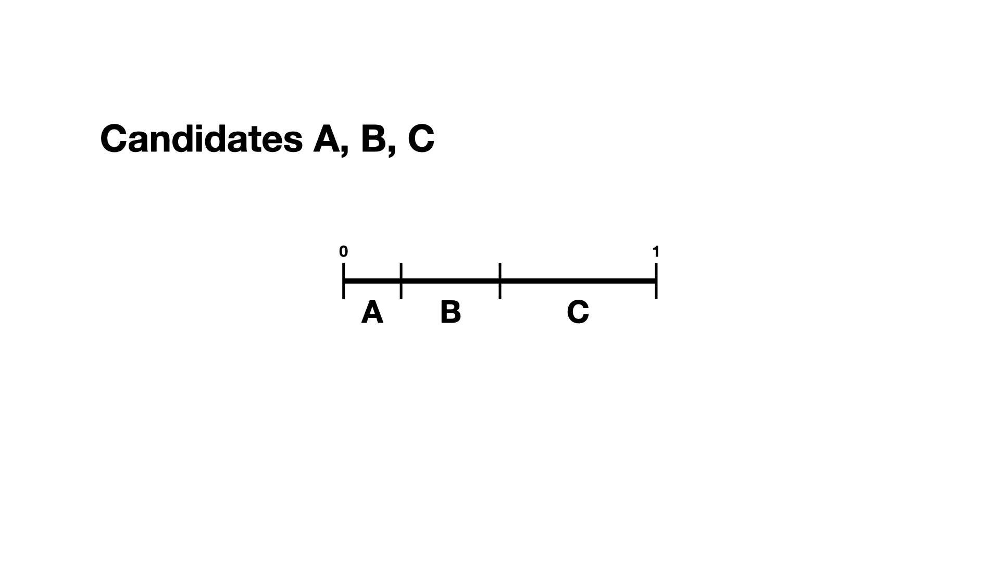

# Preference Intervals

A preference interval stores information about a voter's preferences for candidates. We visualize this, unsurprisingly, as an interval. We take the interval $[0,1]$ and divide it into pieces, where each piece is proportional to the voter's preference for a particular candidate. If we have two candidates $A,B$, we fix an order of our interval and say that the first piece will denote our preference for $A,$ and the second for $B$. As an abuse of notaton, one could write $(A,B)$, where we let $A$ represent the candidate and the length of the interval. For example, if a voter likes candidate $A$ a lot more than $B$, they might have the preference interval $(0.9, 0.1)$. This can be extended to any number of candidates, as long as each entry is non-negative and the total of the entries is 1.

We have not said how this preference interval actually gets translated into a ranked ballot for a particular voter. That we leave up to the ballot generator models, like the Plackett-Luce model.

It should be remarked that there is a difference, at least to VoteKit, between the intervals $(0.9,0.1,0.0)$ and $(0.9,0.1)$. While both say there is no preference for a third candidate, if the latter interval is fed into VoteKit, that third candidate will never appear on a generated ballot. If we feed it the former interval, the third candidate will always appear at the bottom of the ballot.

VoteKit provides an option, [from_params](api.md#ballot-generators), which allows you to randomly generate preference intervals. For more on how this is done, see the page on [Simplices](SCR_simplex.md).

