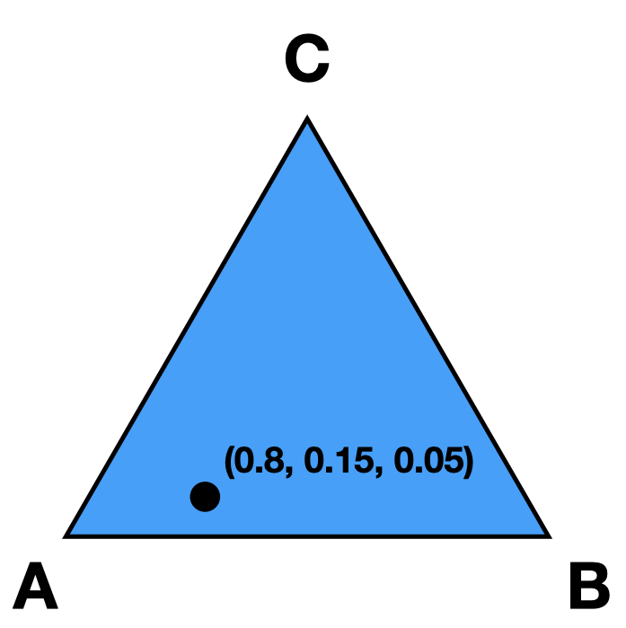
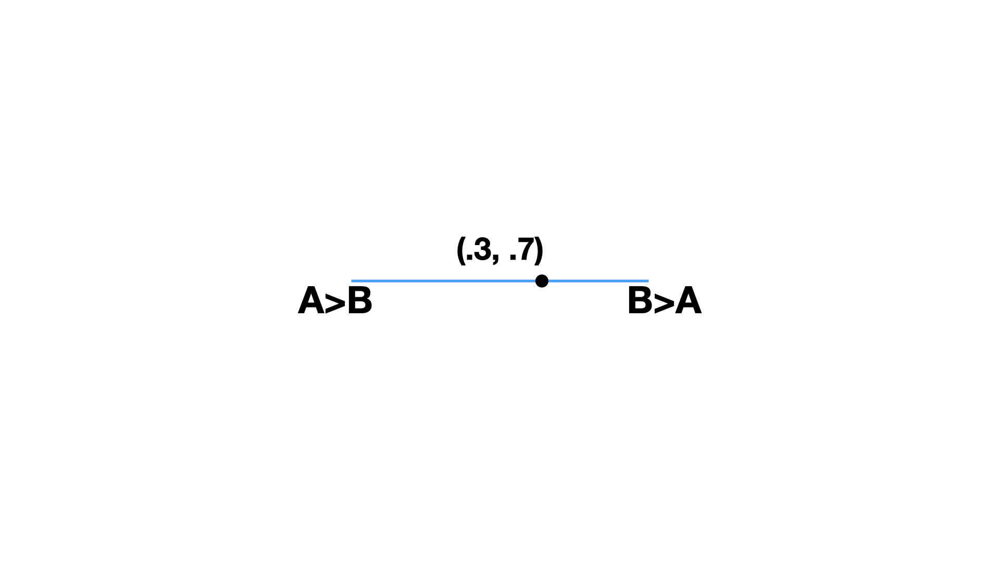
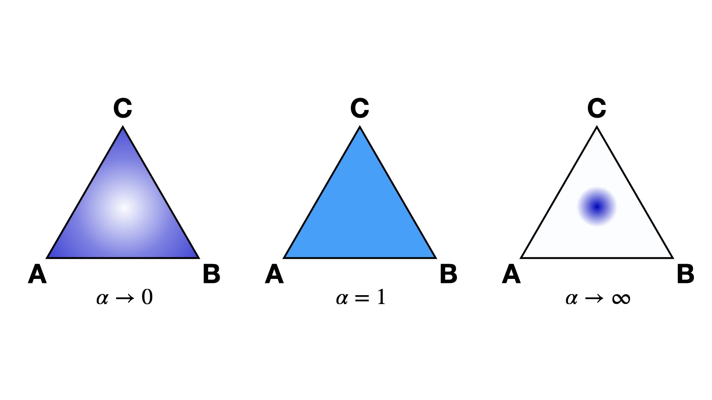
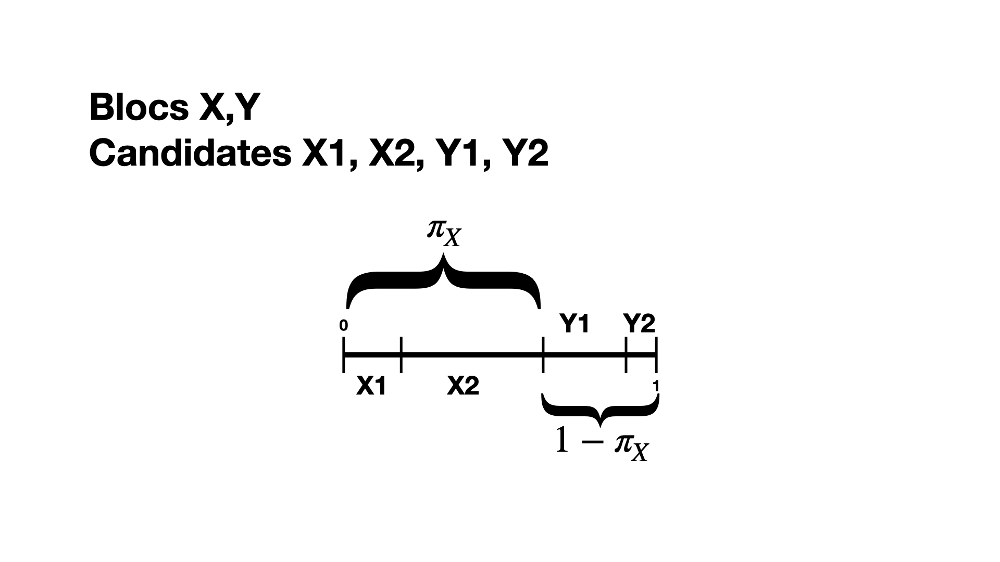

# Simplices in Social Choice

## Candidate Simplex
There is a unique correspondence between preference intervals and points in the candidate simplex.
This will be easiest to visualize with three candidates; let's call them $A,B,C$. Our candidate simplex is a triangle, with each vertex representing one of the candidates.
If a point on the simplex is close to vertex $A$, that means the point represents a preference interval with strong preference for $A$ (likewise for $B$ or $C$).

More formally, we have vectors $e_A = (1,0,0), e_B = (0,1,0), e_C = (0,0,1)$.  Each point on the triangle is a vector $(a,b,c)$ where $a+b+c=1$ and $a,b,c\ge 0$. That is, each point is a *convex combination* of the vectors $e_A, e_B,e_C$. The value of $a$ denotes someone's "preference" for $A$. Thus, a point in the candidate simplex is precisely a preference interval for the candidates!

The candidate simplex extends to an arbitrary number of candidates.

## Ballot Simplex

The ballot simplex is the same thing as the candidate simplex, except now the vertices of the simplex represent full linear rankings.
So in the case of 3 candidates, we have $3!=6$ vertices, one for each permutation of the ranking $A>B>C$.
A point in the ballot simplex represents a probability distribution over these full linear rankings.
This is much harder to visualize since we're stuck in 3 dimensions! 

Read about the [BallotSimplex](api.md#ballot-generators) object.

## Dirichlet Distribution

Throughout VoteKit, it will be useful to be able to sample from the candidate simplex (if we want to generate preference intervals) or the ballot simplex (if we want a distribution on rankings). How will we sample from the simplex? The Dirichlet distribution! 

In what follows, we will presume we are discussing the candidate simplex, but it all applies to the ballot simplex as well. The Dirichlet distribution is a probability distribution on the simplex. We parameterize it with a value $\alpha \in (0,\infty)$. 
As $\alpha\to \infty$, the mass of the distribution moves to the center of the simplex. This means we are more likely to sample preference intervals that have equal support for all candidates. As $\alpha\to 0$, the mass moves to the vertices. This means we are more likely to sample preference intervals that have strong support for one candidate.
When $\alpha=1$, all bets are off. In this regime, we have no knowledge of which candidates are likely to receive support.

The value $\alpha$ is never allowed to be 0 or $\infty$, so VoteKit uses an arbitrary large number ($10^{20}$) and an arbitrary small number $(10^{-10})$. When members of MGGG have done experiments for studies, they have taken $\alpha = 1/2$ to be small and $\alpha = 2$ to be big.

## Multiple Blocs

### Cohesion Parameters

When there are multiple blocs, or types, of voters, we utilize cohesion parameters to measure how much voters prefer candidates from their own bloc versus the opposing blocs. In our name models, like `name_PlackettLuce` or `name_BradleyTerry`, the cohesion parameters operate as follows. Suppose there are two blocs of voters, $X,Y$. We assume that voters from the $X$ bloc have some underlying [preference interval](SCR_preference_intervals.md) $I_{XX}$ for candidates within their bloc, and a different underlying preference interval $I_{XY}$ for the candidates in the opposing bloc. In order to construct one preference interval for $X$ voters, we take $I_{XX}$ and scale it by $\pi_X$, then we take $I_{XY}$ and scale it by $1-\pi_X$, and finally we concatenate the two. As a concrete example, if $\pi_X = .75$, this means that 3/4 of the preference interval for $X$ voters is taken up by candidates from the $X$ bloc, and the other 1/4 by $Y$ candidates.

In our slate models, like `slate_PlackettLuce`, the cohesion parameter is used to determine the probability of sampling a particular slate at each position in the ballot. How exactly this is done depends on the model. Then candidate names are filled in afterwards by sampling without replacement from each preference interval.
### Combining Dirichlet and Cohesion

When there are multiple blocs of voters, we need more than one $\alpha$ value for the Dirichlet distribution. Suppose there are two blocs of voters, $X,Y$. Then we need four values, $\alpha_{XX}, \alpha_{XY}, \alpha_{YX}, \alpha_{YY}$. The value $\alpha_{XX}$ determines what kind of preferences $X$ voters will have for $X$ candidates. The value $\alpha_{XY}$ determines what kind of preferences $X$ voters have for $Y$ candidates. We sample preference intervals from the candidate simplex using these $\alpha$ values, and then use cohesion parameters to combine them into a single interval, one for each bloc. This is how [from_params](api.md#ballot-generators) initializes different ballot generator models.

