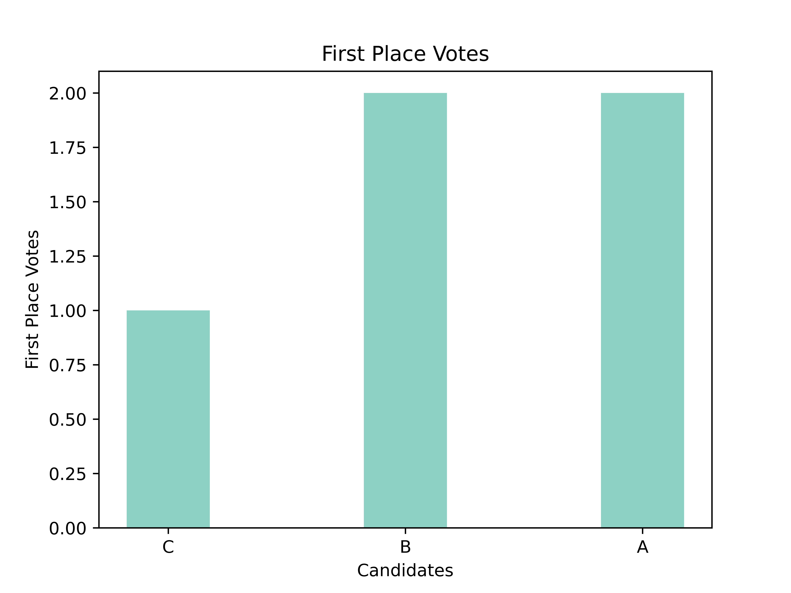
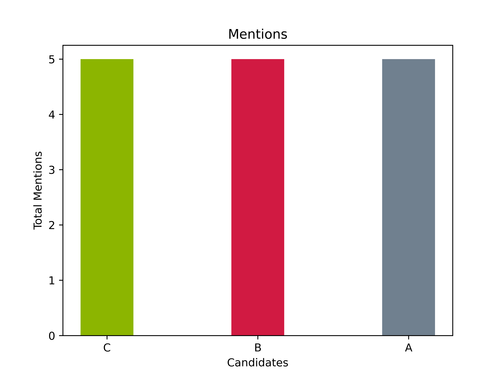
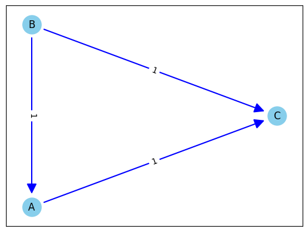
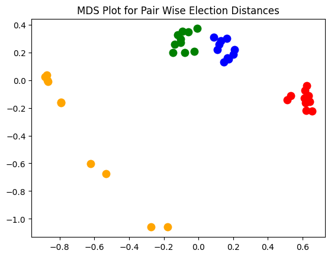
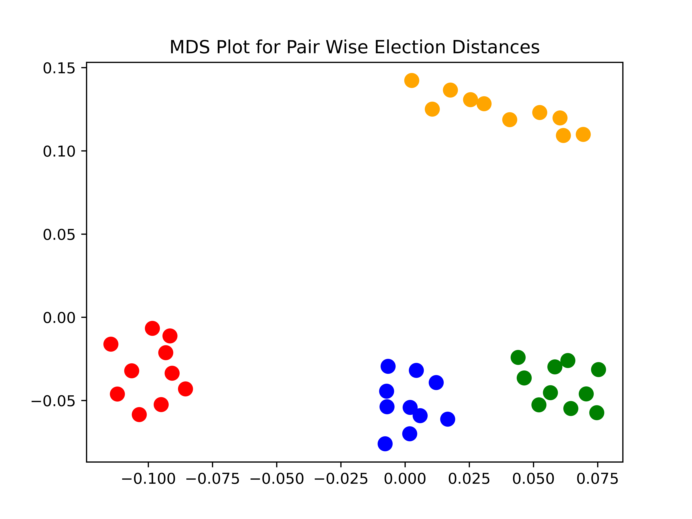

# Summarizing Elections
Now that we can run elections, let's explore how we can use `votekit` to summarize and visualize the results. To do so, we will not use real election data, but rather some generated preference profiles. `votekit` offers support for the following kinds of ballot generating models: Plackett-Luce, Bradley-Terry, Alternating Crossover, a Cambridge Sampler (this one is custom!), 1-D Spatial, Impartial Culture, and Impartial Anonymous Culture.

For simplicity, let's start with the Impartial Culture model, which assumes that when there are $m$ candidates, a voter casts a ballot by choosing uniformly at random from the $m!$ total linear orderings of the candidates.


```python
import votekit.ballot_generator as bg
from votekit.plots import plot_summary_stats, plot_MDS
from votekit.graphs import PairwiseComparisonGraph, BallotGraph
from votekit.metrics import earth_mover_dist, lp_dist
from votekit import Ballot, PreferenceProfile
from functools import partial
from fractions import Fraction
```


```python
# the list of candidates
candidates = ["A", "B", "C"]

# initializing the ballot generator
ic = bg.ImpartialCulture(candidates=candidates)

# generate 5 ballots under the IC model
number_of_ballots = 5
profile = ic.generate_profile(number_of_ballots)

# since this is a small preference profile, we can print the entire thing
print(profile)
```

      Ballots  Weight
    (B, C, A)       1
    (A, B, C)       1
    (A, C, B)       1
    (B, A, C)       1
    (C, B, A)       1


`votekit` comes with some basic summary statistics to help you analyze a profile. We can plot the number of first place votes each candidate received, the number of mentions they receive (i.e. the total number of times they appeared on a ballot), and a Borda count, which assigns $n-1$ points to the first place winner of a ballot, $n-2$ to the second place, ..., and 0 to the last place winner of a ballot.


```python
fig = plot_summary_stats(profile, "first place votes", multi_color = False, title = "First Place Votes")
fig = plot_summary_stats(profile, "borda", multi_color = False, title = "Borda Scores")
fig = plot_summary_stats(profile, "mentions", multi_color = True, title = "Mentions")
```


    

    


    

    


    

    


Check for understanding: In the IC model we are using, why is the number of mentions uniform?

## Graphs!

There are two kinds of graphs (networks) that `votekit` generates, a pairwise comparison graph, and a ballot graph. The former has vertices=candidates, and an edge going from A to B if A is preferred to B more often in the given preference profile. The edge is given weight equal to the number of times A is preferred to B minus the number of times B is preferred to A. You can learn about ballot graphs in the [BallotGraph](ballot_graph_tutorial.md) section.

## `PairwiseComparisonGraph`

`PairwiseComparisonGraph` takes in a `PreferenceProfile`. There is an optional `ballot_length` parameter that determines the length of the ballot and then the `PairwiseComparisonGraph` graph will randomly fill in any ballots that are too short. Since we are using IC ballots which have a full linear ranking, we don't need to worry about that.


```python
pwc_graph = PairwiseComparisonGraph(profile)
pwc_graph.draw()
```


    

    


Check for understanding: are the edge weights what you expect given your `PreferenceProfile`?

`PairwiseComparisonGraph` has methods for computing dominating tiers and the existence of a condorcet winner. A dominating tier is a group of candidates that beats every candidate not in the set in a head-to-head comparison. A condorcet winner is a candidate who wins every head-to-head contest with every other candidate.


```python
print(pwc_graph.dominating_tiers())
print()
print(pwc_graph.has_condorcet())
```

    [{'B'}, {'A'}, {'C'}]
    
    True


`PairwiseComparisonGraph` also has a `compute_pairwise_dict` method which computes the edge weights for the graph, as well as `head2head_count` which computes the number of times that candidate A is preferred to candidate B.

## MDS Plots

One of the cool features of `votekit` is that we can create MDS plots, using different notions of distance between preference profiles. An MDS plot, in short, is a 2D representation of high dimensional data that attempts to minimize the distortion of the data. `votekit` comes with two distance metrics, the earthmover distance and the $L_p$ distance.

Let's explore how an MDS plot can show us the difference between different types of ballot generating models. We will explain what these generating models are doing in a different tutorial.


```python
number_of_ballots = 1000


candidates = ["W1", "W2", "C1", "C2"]
slate_to_candidate = {"W": ["W1", "W2"], "C": ["C1", "C2"]}
bloc_crossover_rate = {"W": {"C": 0.3}, "C": {"W": 0.4}}
pref_interval_by_bloc = {
    "W": {"W1": 0.4, "W2": 0.3, "C1": 0.2, "C2": 0.1},
    "C": {"W1": 0.2, "W2": 0.2, "C1": 0.3, "C2": 0.3},
}
bloc_voter_prop = {"W": 0.7, "C": 0.3}

ic = bg.ImpartialCulture(candidates=candidates)

pl = bg.PlackettLuce(pref_interval_by_bloc=pref_interval_by_bloc,
                     bloc_voter_prop=bloc_voter_prop, candidates=candidates)

bt = bg.BradleyTerry(pref_interval_by_bloc=pref_interval_by_bloc,
                     bloc_voter_prop=bloc_voter_prop, candidates=candidates)

ac = bg.AlternatingCrossover(pref_interval_by_bloc=pref_interval_by_bloc,
                             bloc_voter_prop=bloc_voter_prop, candidates=candidates,
                             slate_to_candidates=slate_to_candidate, bloc_crossover_rate=bloc_crossover_rate)
```

`plot_MDS` takes in a `data` parameter, which is a dictionary whose keys are the colors you want to plot a particular list of `PreferenceProfiles` in and whose values are the lists of `PreferenceProfile` objects, a `distance` parameter that sets the metric between preference profiles, and `marker_size` which determines the size of the data points.


```python
# this allows us to generate 10 preference profiles under each ballot generator
plot = plot_MDS(data = {'red': [ic.generate_profile(number_of_ballots) for i in range(10)], 
                        'blue': [pl.generate_profile(number_of_ballots) for i in range(10)], 
                        'green': [bt.generate_profile(number_of_ballots) for i in range(10)],
                       'orange': [ac.generate_profile(number_of_ballots) for i in range(10)]},
        distance = earth_mover_dist,
               marker_size=100)
```


    

    


Let's try a different metric.


```python
plot = plot_MDS(data = {'red': [ic.generate_profile(number_of_ballots) for i in range(10)], 
                        'blue': [pl.generate_profile(number_of_ballots) for i in range(10)], 
                        'green': [bt.generate_profile(number_of_ballots) for i in range(10)],
                       'orange': [ac.generate_profile(number_of_ballots) for i in range(10)]},
        distance = lp_dist,
               marker_size=100)
```


    

    


By default, the $L_p$ distance function uses $p=1$. If you want to change that, we need the `partial` function from the `functools` module.


```python
plot = plot_MDS(data = {'red': [ic.generate_profile(number_of_ballots) for i in range(10)], 
                        'blue': [pl.generate_profile(number_of_ballots) for i in range(10)], 
                        'green': [bt.generate_profile(number_of_ballots) for i in range(10)],
                       'orange': [ac.generate_profile(number_of_ballots) for i in range(10)]},
        distance = partial(lp_dist, p_value=2),
               marker_size=100)
```


    

    


Finally, to use the $L_\infty$ distance, use the keyword `inf`.


```python
plot = plot_MDS(data = {'red': [ic.generate_profile(number_of_ballots) for i in range(10)], 
                        'blue': [pl.generate_profile(number_of_ballots) for i in range(10)], 
                        'green': [bt.generate_profile(number_of_ballots) for i in range(10)],
                       'orange': [ac.generate_profile(number_of_ballots) for i in range(100)]},
        distance = partial(lp_dist, p_value="inf"),
               marker_size=100)
```


    

    

