Visualizing Ballots
===================

We’ve just gone over reading and cleaning ballots from real-world voting
records and generating ballots using a variety of models. In this
section, we turn to visualizing ballots in a variety of ways.

Summary Statistics
------------------

VoteKit comes with some summary statistics built in for analyzing
ballots. For this, we will introduce the **Impartial Culture** and
**Impartial Anonymous Culture** models of ballot generation, which are
frequently used in social choice scholarly literature, even though they
are far less realistic and flexible than the models we ran in previous
sections!

Impartial Culture (IC) is essentially the :math:`\alpha=\infty` extreme
of the family of Dirichlet measures `from
earlier <2_real_and_simulated_profiles.html#dirichlet-distribution>`__;
that is, the probability of each ranking is set exactly equal. Impartial
Anonymous Culture (IAC) is the :math:`\alpha=1` (“all bets are off”)
case.

.. code:: ipython3

    from votekit.plots import multi_profile_fpv_plot, profile_fpv_plot
    import votekit.ballot_generator as bg
    
    # generate a profile to work with first
    candidates = ["A", "B", "C"]
    
    # initializing the ballot generator
    ic = bg.ImpartialCulture(candidates=candidates)
    iac = bg.ImpartialAnonymousCulture(candidates=candidates)
    
    profile1 = ic.generate_profile(number_of_ballots=1000)
    profile2 = iac.generate_profile(number_of_ballots=1000)
    
    print("IC profile:")
    print(profile1.df)
    print()
    print("IAC profile:")
    print(profile2.df)

.. parsed-literal::

    IC profile:
                 Ranking_1 Ranking_2 Ranking_3 Voter Set  Weight
    Ballot Index                                                
    0                  (C)       (A)       (B)        {}   175.0
    1                  (B)       (C)       (A)        {}   180.0
    2                  (A)       (C)       (B)        {}   186.0
    3                  (A)       (B)       (C)        {}   149.0
    4                  (C)       (B)       (A)        {}   168.0
    5                  (B)       (A)       (C)        {}   142.0
    
    IAC profile:
                 Ranking_1 Ranking_2 Ranking_3 Voter Set  Weight
    Ballot Index                                                
    0                  (B)       (C)       (A)        {}   224.0
    1                  (C)       (A)       (B)        {}   287.0
    2                  (A)       (B)       (C)        {}   336.0
    3                  (B)       (A)       (C)        {}   122.0
    4                  (C)       (B)       (A)        {}    17.0
    5                  (A)       (C)       (B)        {}    14.0

Now we’ll plot some summary statistics for the generated profiles.

- ``first place votes`` will measure how many first place votes each
  candidate received.

- ``borda`` reports the **Borda score** of each candidate. If there are
  :math:`n` candidates on a ballot, the first place candidate gets
  :math:`n` points, the second :math:`n-1`, and so on.

- ``mentions`` simply counts the number of times candidates were listed
  at all. Note that if we use generative methods that produce complete
  rankings, everyone will necessarily have the same number of mentions!

- ``ballot lengths`` is the distribution of ballot lengths in the
  profile. Again, if we use generative methods that produce complete
  rankings, every ballot will be the same length.

We can plot first place votes for one profile or for multiple profiles
as follows.

.. code:: ipython3

    fig1 = profile_fpv_plot(profile1, title="First Place Votes in Profile 1")
    fig2 = multi_profile_fpv_plot(
        {"Profile 1": profile1, "Profile 2": profile2},
        title="First Place Votes",
        show_profile_legend=True,
    )

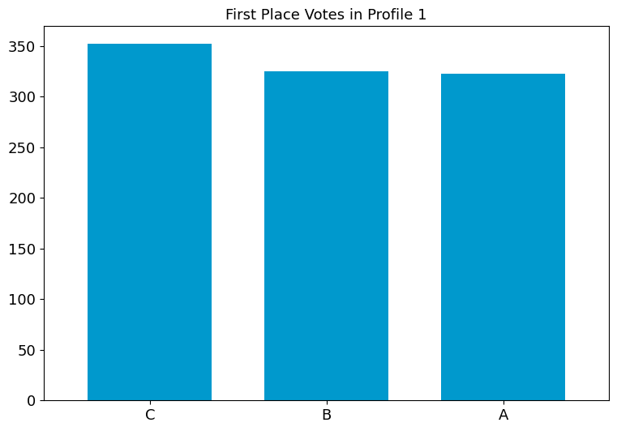

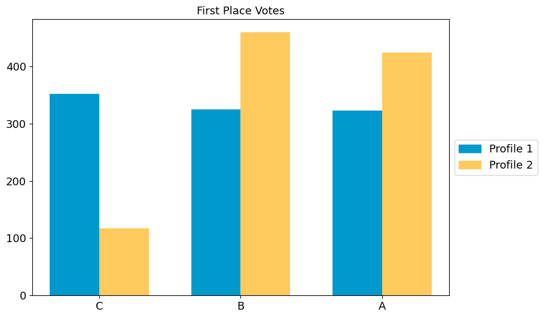

By default, the candidate ordering is determined by the first profile in
the dictionary, and is listed in decreasing order of first place votes.
We can override this with the parameter ``candidate_ordering``.

.. code:: ipython3

    fig2 = multi_profile_fpv_plot(
        {"Profile 1": profile1, "Profile 2": profile2},
        title="First Place Votes",
        show_profile_legend=True,
        candidate_ordering=["A", "B", "C"],
    )

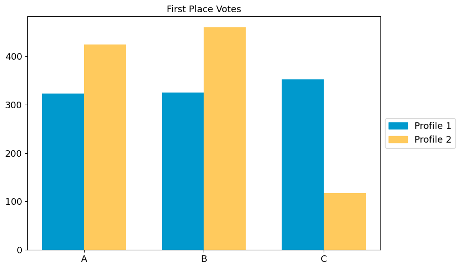

**Try it yourself**
~~~~~~~~~~~~~~~~~~~

   Use some of the other statistics available. Change the function from
   ``profile_fpv_plot`` to ``profile_borda_plot`` and to
   ``profile_ballot_lengths_plot``. Adapt the multi-profile plot
   accordingly. Change the title of the plot to reflect the stat.

Remember! Some generated profiles only have complete ballots.

.. code:: ipython3

    from votekit.plots import (
        multi_profile_borda_plot,
        multi_profile_ballot_lengths_plot,
        profile_borda_plot,
        profile_ballot_lengths_plot,
    )
    
    # TODO add your code here

Pairwise Comparison Graph
-------------------------

The pairwise comparison graph is used for examining head-to-head
contests. Each vertex of the graph is a candidate. If there is an edge
going from :math:`A` to :math:`B`, that means :math:`A` is preferred to
:math:`B` more times in the profile. The weight on the edge is the
number of times :math:`A` is preferred to :math:`B` minus the number of
times :math:`B` is preferred to :math:`A`.

.. code:: ipython3

    from votekit.graphs import PairwiseComparisonGraph
    
    bloc_voter_prop = {"W": 0.8, "C": 0.2}
    
    # the values of .9 indicate that these blocs are highly polarized;
    # they prefer their own candidates much more than the opposing slate
    cohesion_parameters = {"W": {"W": 0.9, "C": 0.1}, "C": {"C": 0.9, "W": 0.1}}
    
    dirichlet_alphas = {"W": {"W": 2, "C": 1}, "C": {"W": 1, "C": 0.5}}
    
    slate_to_candidates = {"W": ["W1", "W2"], "C": ["C1", "C2"]}
    
    cs = bg.CambridgeSampler.from_params(
        slate_to_candidates=slate_to_candidates,
        bloc_voter_prop=bloc_voter_prop,
        cohesion_parameters=cohesion_parameters,
        alphas=dirichlet_alphas,
    )
    
    profile = cs.generate_profile(number_of_ballots=1000)
    print(profile)
    
    pwc_graph = PairwiseComparisonGraph(profile)
    pwc_graph.draw()

.. parsed-literal::

    Profile contains rankings: True
    Maximum ranking length: 4
    Profile contains scores: False
    Candidates: ('C1', 'C2', 'W1', 'W2')
    Candidates who received votes: ('W2', 'C2', 'C1', 'W1')
    Total number of Ballot objects: 90
    Total weight of Ballot objects: 1000.0
    

.. parsed-literal::

    <Axes: >

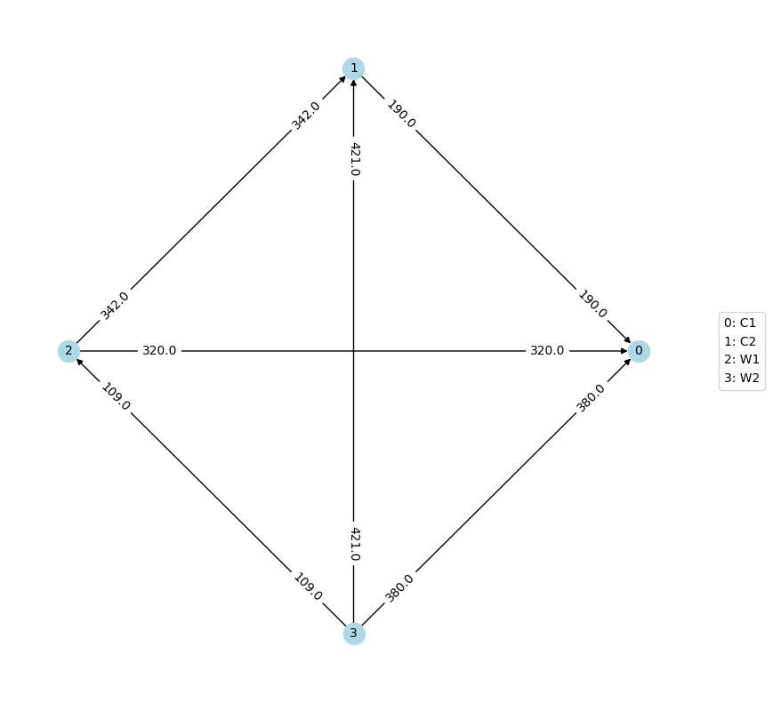

Again, due to randomization, do not expect your graph labels to exactly
match the one pictured in the tutorial.

The ``PairwiseComparisonGraph`` has methods for computing dominating
tiers and the existence of a Condorcet winner (one who beats every other
candidate head-to-head). A **dominating tier** is a group of candidates
that beats every lower-tier candidate in a head-to-head comparison.

.. code:: ipython3

    # dominating tiers
    print("tiers:", pwc_graph.get_dominating_tiers())
    
    # condorcet winner
    if pwc_graph.has_condorcet_winner() == True:
        print("The Condorcet candidate is:", pwc_graph.get_condorcet_winner())
    else:
        print(
            "There is no Condorcet candidate.  The top tier is:",
            pwc_graph.get_dominating_tiers()[0],
        )

.. parsed-literal::

    tiers: [{'W2'}, {'W1'}, {'C2'}, {'C1'}]
    The Condorcet candidate is: W2

MDS Plots
---------

One of the coolest features of VoteKit (in the humble opinion of this
tutorial author) is that we can create multidimensional scaling (MDS)
plots, using different notions of distance between
``PreferenceProfiles``. A multidimensional scaling plot (MDS) is a 2D
representation of high-dimensional data that attempts to minimize the
distortion of the data. VoteKit comes with two kinds of distance
metrics: earth-mover distance and :math:`L_p` distance. You can read
about these in the `VoteKit
documentation <../../social_choice_docs/scr.html#distances-between-preferenceprofiles>`__.

Let’s explore how an MDS plot can provide a powerful visualization.
First we will initialize our generators.

.. code:: ipython3

    from votekit.plots import plot_MDS, compute_MDS
    from votekit.metrics import earth_mover_dist, lp_dist
    from votekit import PreferenceInterval
    
    number_of_ballots = 100
    
    slate_to_candidates = {"all_voters": ["A", "B", "C"]}
    
    prefs1 = {
        "all_voters": {"all_voters": PreferenceInterval({"A": 0.8, "B": 0.15, "C": 0.05})}
    }
    prefs2 = {
        "all_voters": {"all_voters": PreferenceInterval({"A": 0.1, "B": 0.5, "C": 0.4})}
    }
    
    bloc_voter_prop = {"all_voters": 1}
    cohesion_parameters = {"all_voters": {"all_voters": 1}}
    
    pl1 = bg.name_PlackettLuce(
        slate_to_candidates=slate_to_candidates,
        bloc_voter_prop=bloc_voter_prop,
        pref_intervals_by_bloc=prefs1,
        cohesion_parameters=cohesion_parameters,
    )
    
    pl2 = bg.name_PlackettLuce(
        slate_to_candidates=slate_to_candidates,
        bloc_voter_prop=bloc_voter_prop,
        pref_intervals_by_bloc=prefs2,
        cohesion_parameters=cohesion_parameters,
    )
    
    bt1 = bg.name_BradleyTerry(
        slate_to_candidates=slate_to_candidates,
        bloc_voter_prop=bloc_voter_prop,
        pref_intervals_by_bloc=prefs1,
        cohesion_parameters=cohesion_parameters,
    )
    
    bt2 = bg.name_BradleyTerry(
        slate_to_candidates=slate_to_candidates,
        bloc_voter_prop=bloc_voter_prop,
        pref_intervals_by_bloc=prefs2,
        cohesion_parameters=cohesion_parameters,
    )

We have uncoupled the computation and plotting features since the
computation is often time intensive, and this allows users to fiddle
with the plot without recomputing the coordinates.

.. code:: ipython3

    import matplotlib.pyplot as plt
    
    # the data is a dictionary whose keys correspond to data labels
    # and whose values are lists of PreferenceProfiles
    coord_dict = compute_MDS(
        data={
            "pl1": [pl1.generate_profile(number_of_ballots) for i in range(10)],
            "pl2": [pl2.generate_profile(number_of_ballots) for i in range(10)],
            "bt1": [bt1.generate_profile(number_of_ballots) for i in range(10)],
            "bt2": [bt2.generate_profile(number_of_ballots) for i in range(10)],
        },
        distance=earth_mover_dist,
    )
    
    
    # we pass the computed coordinates, as well as a nested dictionary of plot parameters
    # that will be passed to matplotlib scatter
    ax = plot_MDS(
        coord_dict=coord_dict,
        plot_kwarg_dict={
            "pl1": {"c": "red", "s": 50, "marker": "x"},
            "pl2": {"c": "red", "s": 50, "marker": "o"},
            "bt1": {"c": "blue", "s": 50, "marker": "x"},
            "bt2": {"c": "blue", "s": 50, "marker": "o"},
        },
        legend=True,
        title=True,
    )

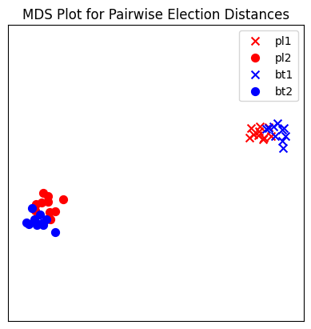

In this plot, each red mark represents a simulated election built from
1000 PL ballots, and each blue mark is likewise 1000 BT ballots, using
the same preference interval. The marker, x or o, denotes the preference
interval type. It’s very important to remember that the x axis and y
axis numbers do not mean ANYTHING in an MDS plot—there’s literally a
randomized algorithm throwing the 40 points into the plane in a manner
that keeps similar things close and puts dissimilar things farther away.
That is why our MDS function does not include any axis labels.

What is this plot telling us? The fact that x’s are in one area and o’s
are in another tells us that the different preference intervals generate
distinct profiles. Moreover, the fact that the red and blue models have
little overlap shows that PL and BT are actually distinguishable as
styles of ranking. This is encouraging!

**Try it yourself**
~~~~~~~~~~~~~~~~~~~

   Increase the size of each profile to 1000 ballots instead of 10; then
   there’s more opportunity for the differences between PL and BT to
   emerge. Make the preference intervals more similar or more different;
   the picture will change accordingly.

Ballot Graph
------------

The last tool we want to introduce for analyzing ballots is the ballot
graph. Each vertex of the ballot graph is a ballot (either a full linear
ranking or a partial one). An edge goes between two ballots if they
either differ by one candidate at the end of the ballot, or by swapping
two adjacent candidates.

We can either initialize the ballot graph from a list of candidates, a
number of candidates, or a preference profile. Let’s start with a list
of candidates first. The ``allow_partial`` parameter tells the graph to
allow incomplete ballots, so when set to ``False`` it only shows the
:math:`n!` permutations of the :math:`n` candidates.

.. code:: ipython3

    from votekit.graphs import BallotGraph
    
    candidates = ["A", "B", "C"]
    
    ballot_graph = BallotGraph(candidates, allow_partial=False)
    ballot_graph.draw(labels=True)
    
    ballot_graph = BallotGraph(candidates, allow_partial=True)
    ballot_graph.draw(labels=True)

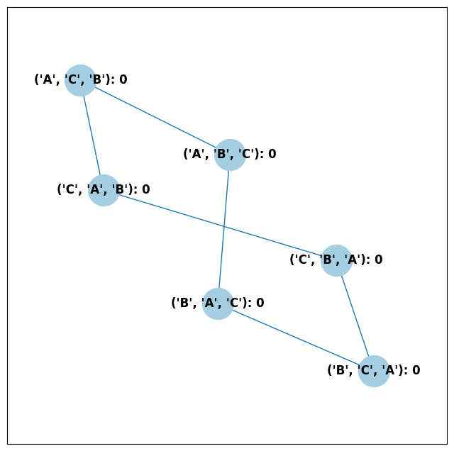

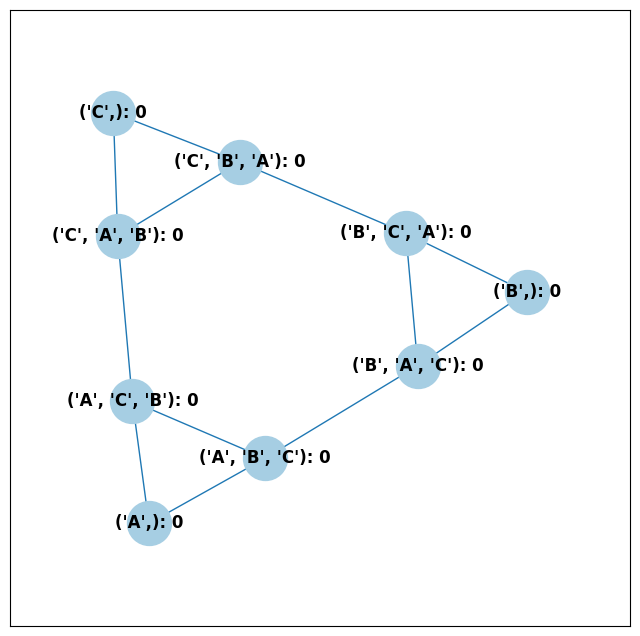

When we set ``labels=True``, the ballot graph displays the candidate
names, as well as the number of votes cast on that ballot. Since this
graph was not constructed from a ``PreferenceProfile``, the number of
votes is 0.

You might be wondering where any of the ballots of length 2 are.
Currently, the ballot graph takes any ballot that lists all but one
candidate and fills in the final candidate. (This might not be how you
want it to behave, and we have plans to implement a version where the
ballot :math:`A>B` is distinct from :math:`A>B>C`.)

The ``BallotGraph`` class has a ``graph`` attribute which stores the
underlying ``networkx`` graph. The ``networkx`` graph is indexed by
integers; the method ``_number_cands`` returns a dictionary that
converts candidate names to these integers.

.. code:: ipython3

    print("candidate dictionary:", ballot_graph._number_cands(cands=tuple(candidates)))
    print()
    
    for node, data in ballot_graph.graph.nodes(data=True):
        print("node", node)
        print(data)
        print()

.. parsed-literal::

    candidate dictionary: {'A': 1, 'B': 2, 'C': 3}
    
    node (1,)
    {'weight': 0, 'cast': False}
    
    node (1, 2, 3)
    {'weight': 0, 'cast': False}
    
    node (1, 3, 2)
    {'weight': 0, 'cast': False}
    
    node (2,)
    {'weight': 0, 'cast': False}
    
    node (2, 3, 1)
    {'weight': 0, 'cast': False}
    
    node (2, 1, 3)
    {'weight': 0, 'cast': False}
    
    node (3,)
    {'weight': 0, 'cast': False}
    
    node (3, 1, 2)
    {'weight': 0, 'cast': False}
    
    node (3, 2, 1)
    {'weight': 0, 'cast': False}
    

The weight attribute would store the number of ballots (if the data came
from an election), and the ``cast`` attribute stores whether or not that
ballot appeared in the profile, i.e., returns ``True`` if the weight is
non-zero.

Now let’s generate a ballot graph from election data.

.. code:: ipython3

    candidates = ["A", "B", "C"]
    
    iac = bg.ImpartialAnonymousCulture(candidates=candidates)
    
    profile = iac.generate_profile(number_of_ballots=1000)
    print(profile)
    
    ballot_graph = BallotGraph(profile)
    ballot_graph.draw(labels=True, show_cast=False)
    
    for node, data in ballot_graph.graph.nodes(data=True):
        print(node, data)

.. parsed-literal::

    Profile contains rankings: True
    Maximum ranking length: 3
    Profile contains scores: False
    Candidates: ('A', 'B', 'C')
    Candidates who received votes: ('C', 'B', 'A')
    Total number of Ballot objects: 6
    Total weight of Ballot objects: 1000.0
    

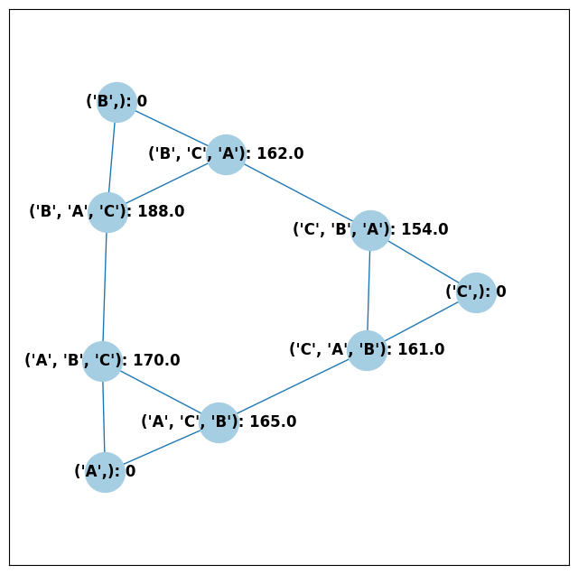

.. parsed-literal::

    (1,) {'weight': 0, 'cast': False}
    (1, 2, 3) {'weight': 404.0, 'cast': True}
    (1, 3, 2) {'weight': 18.0, 'cast': True}
    (2,) {'weight': 0, 'cast': False}
    (2, 3, 1) {'weight': 44.0, 'cast': True}
    (2, 1, 3) {'weight': 277.0, 'cast': True}
    (3,) {'weight': 0, 'cast': False}
    (3, 1, 2) {'weight': 194.0, 'cast': True}
    (3, 2, 1) {'weight': 63.0, 'cast': True}

Check that this is reasonable: only ballots that were in the
``PreferenceProfile`` should have ``cast = True``, and their ``weight``
attribute should correspond to the number of ballots cast. Why do none
of the bullet votes appear in the profile?

**Try it yourself**
~~~~~~~~~~~~~~~~~~~

   If we wanted to visualize only the nodes corresponding to cast
   ballots, we use the ``show_cast = True`` parameter in the ``draw``
   method. You can go back and try that above.

What if we wanted to explore a particular neighborhood of a ballot?
Let’s look at the radius-1 neighborhood around the ballot (3,2,1,4).
This is also called the *1-neighborhood*, and it means (3,2,1,4) and its
immediate neighbors, with their interconnections shown. The
0-neighborhood is only a point itself; the 2-neighborhood is everything
within two steps on the ballot graph.

Here we will initialize the ballot graph from a number, representing the
number of candidates. The scale parameter allows us to better visualize
the crowded graph.

.. code:: ipython3

    ballot_graph = BallotGraph(4)
    ballot_graph.draw(scale=3)
    
    # the neighborhoods parameter takes a list of tuples (node, radius)
    # and displays the corresponding neighborhoods
    ballot_graph.draw(neighborhoods=[((3, 2, 1, 4), 1)])

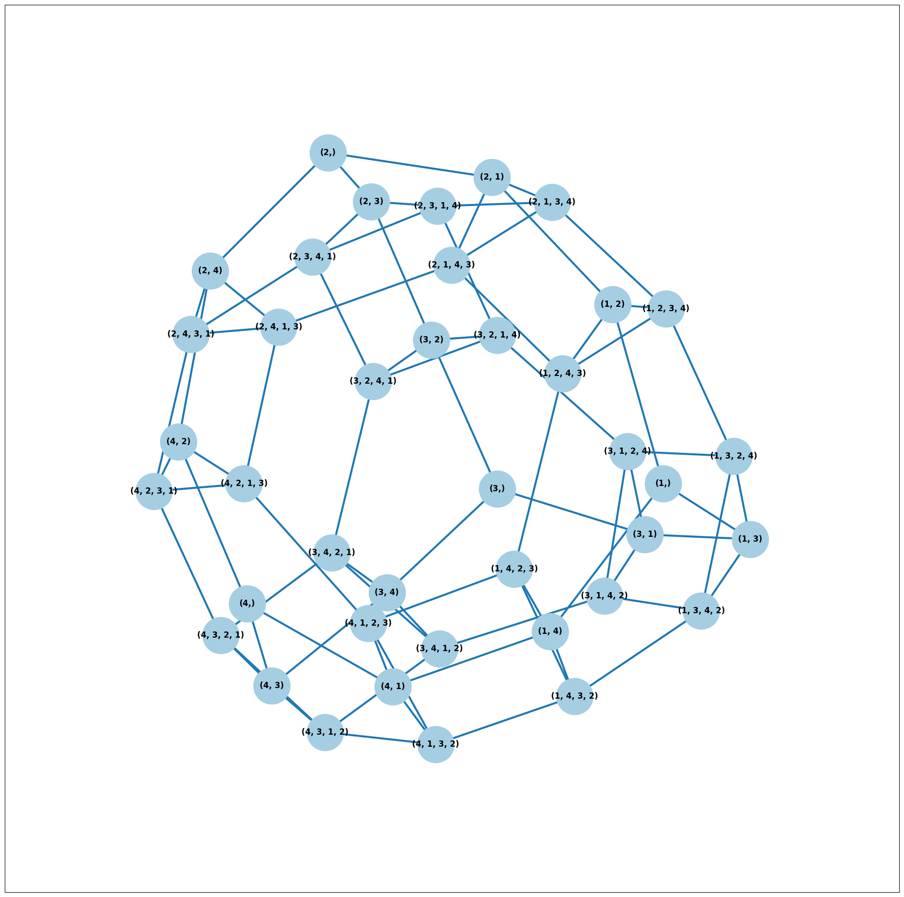

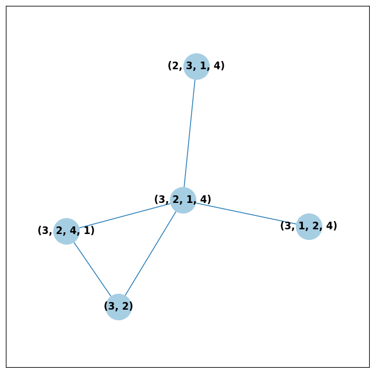

We can also draw multiple neighborhoods.

**Try it yourself**
~~~~~~~~~~~~~~~~~~~

   In addition to the 1-neighborhood of (3,2,1,4), draw the
   1-neighborhood of (2,). Note that you have to write (2,) and not
   simply (2) to designate the node with a bullet vote for candidate 2.

Scottish Elections
------------------

Scottish elections give us a great source for real-world ranked data,
because STV is used for local government elections. Thanks to `David
McCune <https://www.jewell.edu/faculty/david-mccune>`__ of William
Jewell College, we have a fantastic
`repository <https://github.com/mggg/scot-elex>`__ of shiny, clean
ranking data from over 1000 elections, which feature 3-14 candidates
apiece, running with a party label.

Here we load in the CVR from a ward in Comhairle nan Eilean Siar in
2012, in the election for city council. Please download the csv file
`here <https://github.com/mggg/scot-elex/blob/main/4_cands/eilean_siar_2012_ward3.csv>`__
and place it in your working directory (the same folder as your code).

.. code:: ipython3

    from votekit.cvr_loaders import load_scottish
    from votekit.graphs import BallotGraph
    
    # the load_scottish function returns a tuple of information:
    # the first element is the profile itself, the second is the number of seats in the election
    # the third is a list of candidates, the fourth a dictionary mapping candidates to parties,
    # and the fourth the ward name
    scottish_profile, seats, cand_list, cand_to_party, ward = load_scottish(
        "eilean_siar_2012_ward3.csv"
    )
    
    
    # we don't want to alter any ballots so we'll turn off "fix_short"
    ballot_graph = BallotGraph(scottish_profile, fix_short=False)
    
    print(scottish_profile)
    
    
    # only show us the ballots cast
    ballot_graph.draw(show_cast=False, labels=False, scale=3)

.. parsed-literal::

    Profile contains rankings: True
    Maximum ranking length: 4
    Profile contains scores: False
    Candidates: ('Catherine Macdonald', 'D J Macrae', 'Philip Robert Mclean', 'David Cameron Wilson')
    Candidates who received votes: ('Catherine Macdonald', 'Philip Robert Mclean', 'D J Macrae', 'David Cameron Wilson')
    Total number of Ballot objects: 57
    Total weight of Ballot objects: 802.0
    
    The candidates are labeled as follows.
    1 Catherine Macdonald
    2 D J Macrae
    3 Philip Robert Mclean
    4 David Cameron Wilson

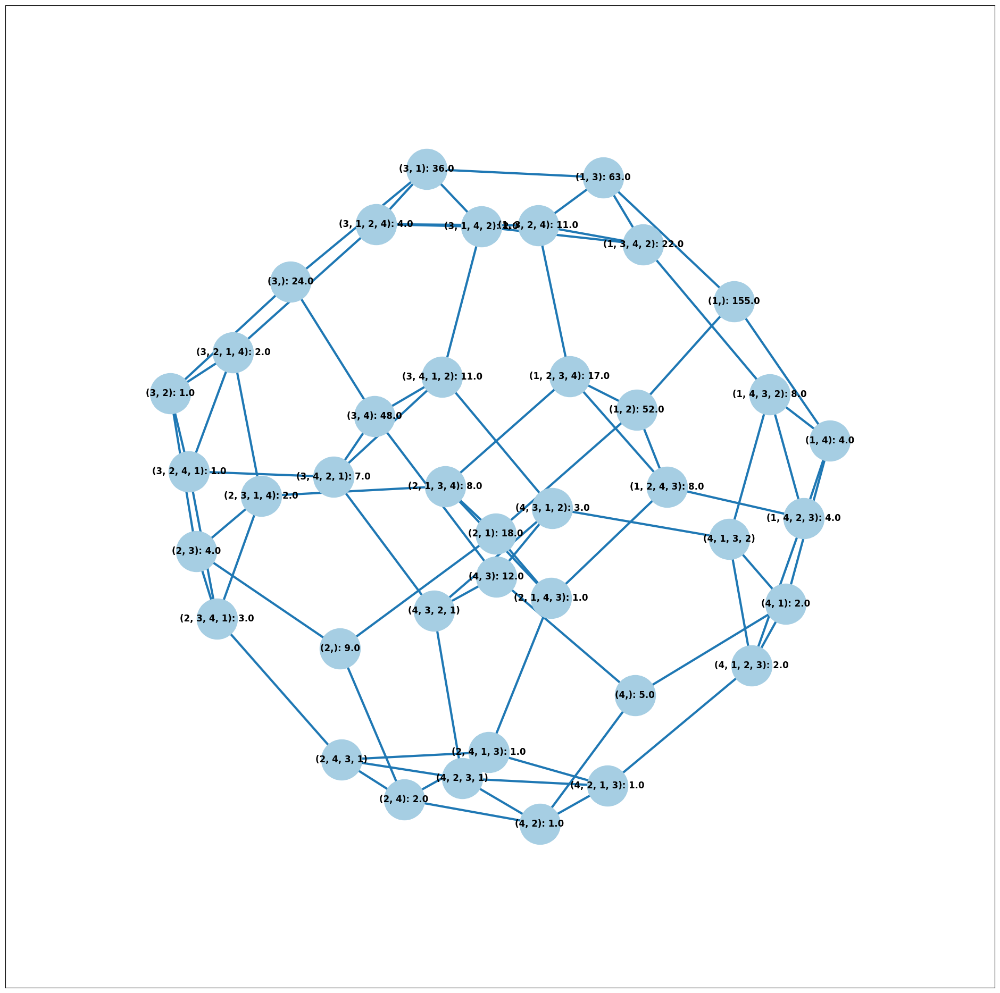

There are 64 possible ballots in an election with 4 candidates (65 if
you count the empty ballot). How many of those ballots types are missing
in this example? Let’s figure out which ones. VoteKit allows you to
create custom display functions for the ballot graph. These functions
must take a ``networkx`` graph and node as input and return ``True`` if
you want to display the node.

.. code:: ipython3

    def show_zero(graph, node):
        # display nodes with no votes
        if graph.nodes[node]["weight"] == 0:
            return True
        return False
    
    
    print("Displaying missing ballots:")
    ballot_graph.draw(labels=False, to_display=show_zero)

.. parsed-literal::

    Displaying missing ballots:
    The candidates are labeled as follows.
    1 Catherine Macdonald
    2 D J Macrae
    3 Philip Robert Mclean
    4 David Cameron Wilson

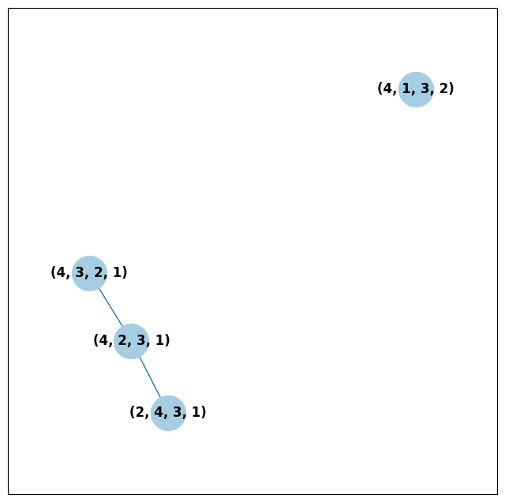

Further Prompts
---------------

- Generate profiles on three candidates in a manner that is reasonably
  likely to result in a **Condorcet cycle**, in which there is no
  Condorcet winner because the arrows go around in, well, a cycle.
- Make MDS plots that include ``ImpartialCulture`` and
  ``CambridgeSampler`` simulations in addition to PL and BT.
- We have also implemented ``lp_dist`` as an alternative to
  ``earth_mover_dist``. The :math:`L_p` distance is parameterized by
  :math:`p\in (0, \infty]`. It defaults to :math:`p=1`. If we want
  another value for :math:`p` we will need to use the ``partial``
  function from the ``functools`` module. (If you want :math:`p=\infty`,
  type ``p_value="inf"``.)

.. code:: ipython3

    from functools import partial
    
    # this code is what you would give to the distance parameter
    # if you wanted something other than p=1
    distance = partial(lp_dist, p_value=47)

- Generate a ballot graph from a ``PreferenceProfile`` so we can see how
  these attributes change. Create a profile with 3 candidates using the
  ``ImpartialCulture`` model. To create the ballot graph from a profile,
  simply pass it in as ``BallotGraph(profile)``. Print your profile,
  display the ballot graph, and print out the data of each node. Confirm
  that these all match!
- Write a custom display function for a ballot graph to display ballots
  that have more than 30 votes.
