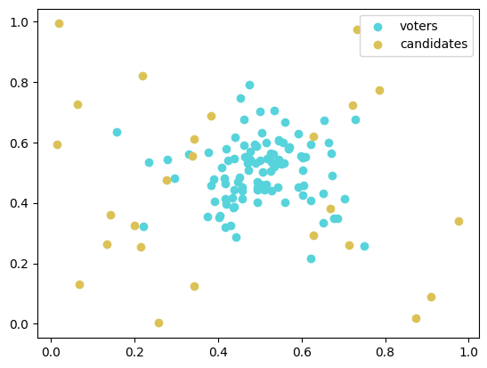
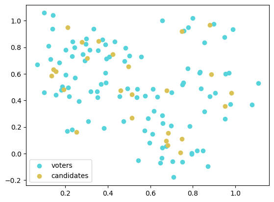
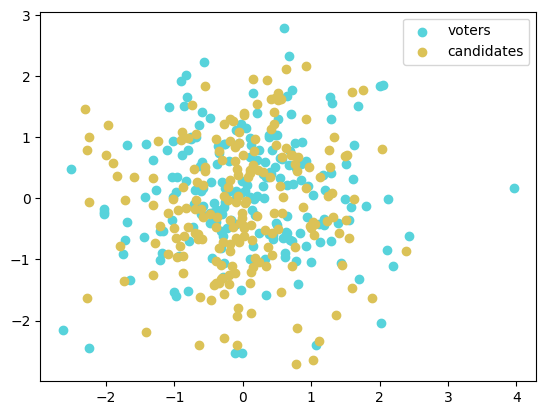
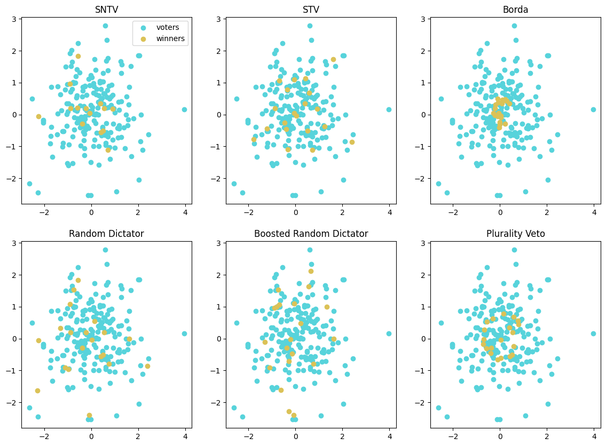
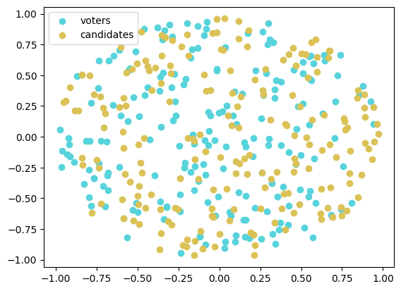
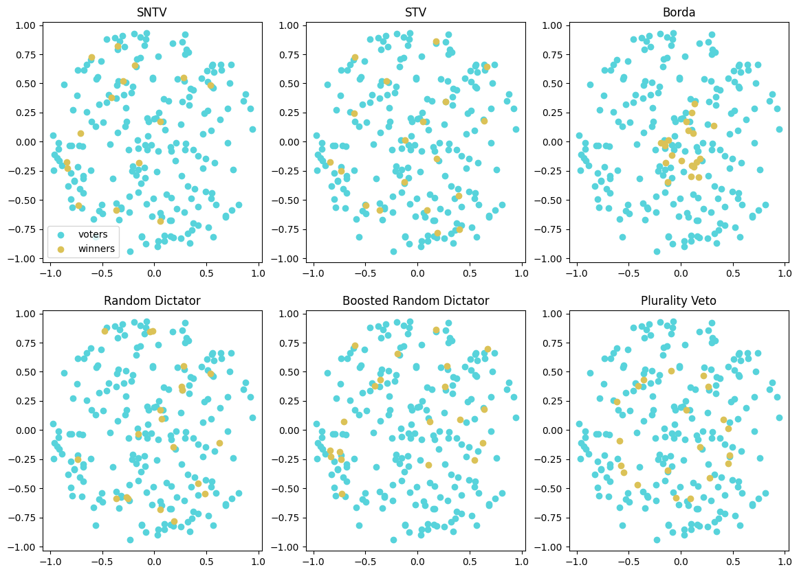
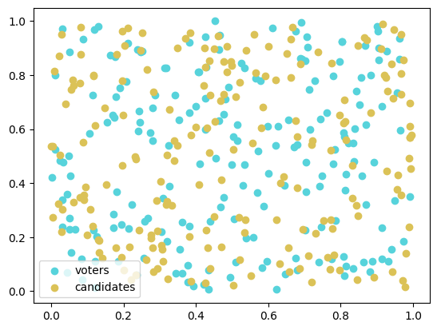
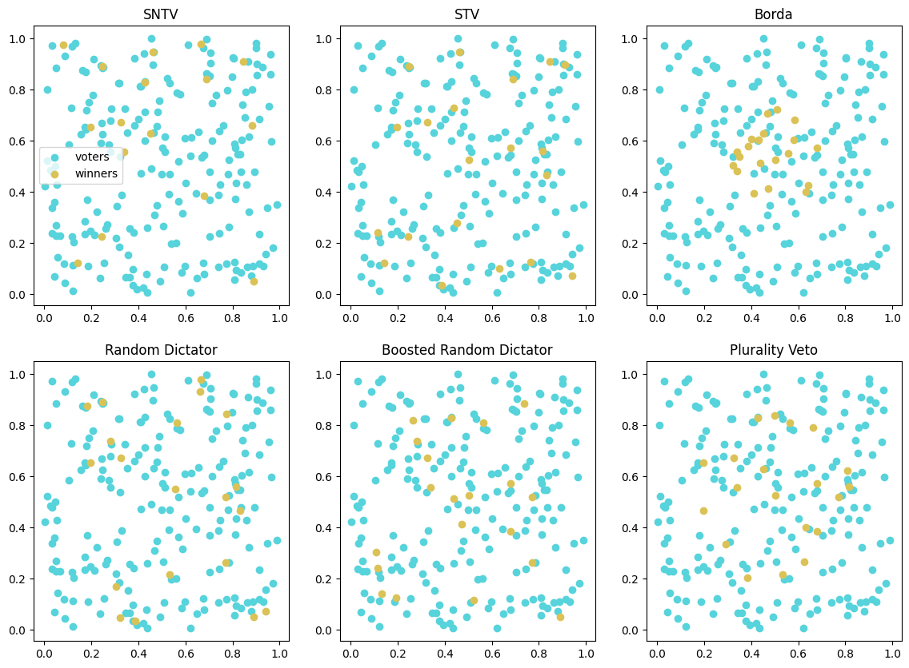
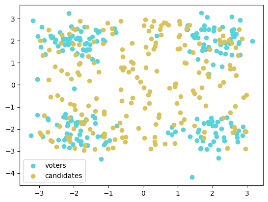
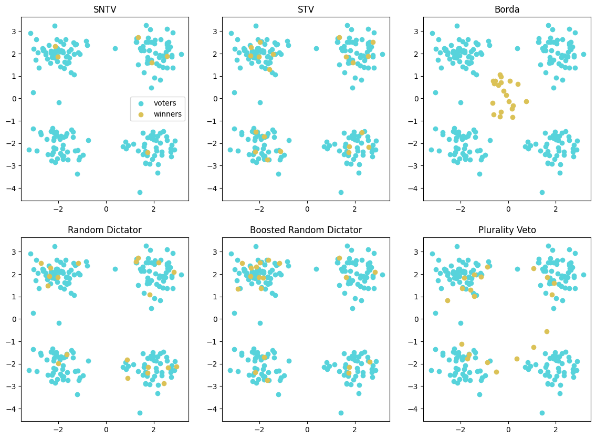

.. code:: ipython3

    import sys
    import os
    import numpy as np
    import matplotlib.pyplot as plt
    import random
    import seaborn as sns
    import itertools as it
    
    from votekit.pref_profile import PreferenceProfile
    from votekit.ballot import Ballot
    from votekit.ballot_generator import spacial_profile_and_positions_generator, clustered_spacial_profile_and_positions_generator
    from votekit.elections import (
        SNTV,
        STV,
        Borda,
        RandomDictator,
        BoostedRandomDictator,
        PluralityVeto,
        fractional_transfer,
    )

Metric Ballot Generation
========================

Here we show some examples from a setting where voters and candidates
occupy random positions in a metric space. With voters metric positions
drawn from a distribution :math:`D_V`, candidates metric positions drawn
from a distribution :math:`D_C`, and a distance function
:math:`d: V \times C \rightarrow \mathbb{R}`, we generate ballots by
sampling from :math:`D_V`, :math:`D_C` and then create ballots by
ranking the candidates by distance to each voter.

.. code:: ipython3

    # Choose number of voters n
    # And the number of candidates m
    n = 100
    m = 25
    candidates = [str(i) for i in range(m)]

.. code:: ipython3

    # We can use any numpy distribution (or custom distribution -- more on that later)
    # to randomly sample  positions for voters and canidates.
    # Here we sample from the following distributions distributions
    # Voters: Normal(mean = 1/2, std = 1/10) in 2d
    # Candidates: Uniform(0,1) in 2d
    
    # Define a dictionary of parameters for both distributions
    # for a full list of possible distributions and their
    # required parameters check out:
    # https://numpy.org/doc/1.16/reference/routines.random.html
    voter_params = {"loc": 0.5, "scale": 0.1, "size": 2}
    candidate_params = {"low": 0, "high": 1, "size": 2}
    
    # We also define a distance function to compute the
    # distances between any pair of voters and candidates.
    # Here, we just use euclidean distance
    distance = lambda point1, point2: np.linalg.norm(point1 - point2)
    
    # Now we may pass all of to the Spatial generation method and generate a profile
    profile, candidate_position_dict, voter_positions= spacial_profile_and_positions_generator(number_of_ballots=n,
        candidates=candidates,
        voter_dist=np.random.normal,
        voter_dist_kwargs=voter_params,
        candidate_dist=np.random.uniform,
        candidate_dist_kwargs=candidate_params,
        distance=distance,
    )

.. code:: ipython3

    # And then visualize the results
    candidate_positions = np.array([i for i in candidate_position_dict.values()])
    pal = sns.color_palette("hls", 8)
    plt.scatter(voter_positions[:, 0], voter_positions[:, 1], label="voters", color=pal[4])
    plt.scatter(
        candidate_positions[:, 0],
        candidate_positions[:, 1],
        label="candidates",
        color=pal[1],
    )
    plt.legend()

.. parsed-literal::

    <matplotlib.legend.Legend at 0x7f13a86ae350>

.. code:: ipython3

    # In another setting, we may imagine that voters are
    # normally distributed around each of the candidates
    
    # Like before we'll have a candidate distribution.
    # For now, just use the same Uniform(0,1) in 2d
    candidate_params = {"low": 0, "high": 1, "size": 2}
    
    # And stick to euclidean distance
    distance = lambda point1, point2: np.linalg.norm(point1 - point2)
    
    # But now, for each candidate, we'll assign to them a certain
    # number of voters. Let's evenly distribute voters amongst candidates
    ballots_per = {c: n // m for c in candidates}
    
    # Those voters will be normally distributed around their candidate
    # i.e. the mean of their normal distribution is at the candidate.
    # And we'll give them the remaining parmaters:
    voter_params = {"scale": 0.1, "size": 2}
    
    # Now we may pass all of to the Spatial generation method
    profile, candidate_position_dict, voter_positions = clustered_spacial_profile_and_positions_generator(number_of_ballots=ballots_per,
        candidates=candidates,
        voter_dist=np.random.normal,
        voter_dist_kwargs=voter_params,
        candidate_dist=np.random.uniform,
        candidate_dist_kwargs=candidate_params,
        distance=distance,
    )

.. code:: ipython3

    # And then visualize the results
    candidate_positions = np.array([i for i in candidate_position_dict.values()])
    pal = sns.color_palette("hls", 8)
    plt.scatter(voter_positions[:, 0], voter_positions[:, 1], label="voters", color=pal[4])
    plt.scatter(
        candidate_positions[:, 0],
        candidate_positions[:, 1],
        label="candidates",
        color=pal[1],
    )
    plt.legend()

.. parsed-literal::

    <matplotlib.legend.Legend at 0x7f13a870a710>

Elections in Metric Settings
============================

Suppose voters and candidates occupy positions in a metric space and an
election mechanism :math:`M` decides on a winner set by looking at the
ranked ballots. In this section we compare the location in the metric
space of the winning candidates. We take inspiration and recreate some
examples from `Elkind et al 2019 <https://arxiv.org/abs/1901.09217>`__.

.. code:: ipython3

    # Choose number of voters n
    # And the number of candidates m
    n = 200
    m = 200
    candidates = [str(i) for i in range(m)]
    
    # And the number of winners for the election
    num_seats = 20

Gaussian Generation
-------------------

Here voters and vandidates are both drawn from the
:math:`\sim \text{Normal}(0,1)` distribution.

.. code:: ipython3

    voter_params = {"loc": 0, "scale": 1, "size": 2}
    candidate_params = {"loc": 0, "scale": 1, "size": 2}
    distance = lambda point1, point2: np.linalg.norm(point1 - point2)
    
    profile, candidate_position_dict, voter_positions = spacial_profile_and_positions_generator(number_of_ballots=n,
        candidates=candidates,
        voter_dist=np.random.normal,
        voter_dist_kwargs=voter_params,
        candidate_dist=np.random.normal,
        candidate_dist_kwargs=candidate_params,
        distance=distance,
    )

.. code:: ipython3

    # visualize the results
    candidate_positions = np.array([i for i in candidate_position_dict.values()])
    pal = sns.color_palette("hls", 8)
    plt.scatter(voter_positions[:, 0], voter_positions[:, 1], label="voters", color=pal[4])
    plt.scatter(
        candidate_positions[:, 0],
        candidate_positions[:, 1],
        label="candidates",
        color=pal[1],
    )
    plt.legend()

.. parsed-literal::

    <matplotlib.legend.Legend at 0x7f13a8880c50>

Elections
~~~~~~~~~

.. code:: ipython3

    # Now run a few different election mechanisms on the profile generated above
    # to decide on a winner set.
    
    # SNTV
    sntv_election = SNTV(profile, num_seats, tiebreak="random")
    sntv_winners = [int(list(i)[0]) for i in sntv_election.get_elected()]
    
    # STV
    # this will raise a lot of tiebreak warnings, that is ok!
    stv_election = STV(profile, num_seats, quota="droop")
    stv_winners = [int(list(i)[0]) for i in stv_election.get_elected()]
    
    # k-Borda
    borda_election = Borda(profile, num_seats)
    borda_winners = [int(list(i)[0]) for i in borda_election.get_elected()]
    
    # k-Random Dictator
    random_election = RandomDictator(profile, num_seats)
    random_winners = [int(list(i)[0]) for i in random_election.get_elected()]
    
    # k-Boosted Random Dictator
    boosted_random_election = BoostedRandomDictator(profile, num_seats)
    boosted_random_winners = [
        int(list(i)[0]) for i in boosted_random_election.get_elected()
    ]
    
    # k-Plurality Veto
    plurality_veto_election = PluralityVeto(profile, num_seats)
    plurality_veto_winners = [
        int(list(i)[0]) for i in plurality_veto_election.get_elected()
    ]

.. parsed-literal::

    Initial tiebreak was unsuccessful, performing random tiebreak
    Initial tiebreak was unsuccessful, performing random tiebreak
    Initial tiebreak was unsuccessful, performing random tiebreak
    Initial tiebreak was unsuccessful, performing random tiebreak
    Initial tiebreak was unsuccessful, performing random tiebreak
    Initial tiebreak was unsuccessful, performing random tiebreak
    Initial tiebreak was unsuccessful, performing random tiebreak
    Initial tiebreak was unsuccessful, performing random tiebreak
    Initial tiebreak was unsuccessful, performing random tiebreak
    Initial tiebreak was unsuccessful, performing random tiebreak
    Initial tiebreak was unsuccessful, performing random tiebreak
    Initial tiebreak was unsuccessful, performing random tiebreak
    Initial tiebreak was unsuccessful, performing random tiebreak
    Initial tiebreak was unsuccessful, performing random tiebreak
    Initial tiebreak was unsuccessful, performing random tiebreak
    Initial tiebreak was unsuccessful, performing random tiebreak
    Initial tiebreak was unsuccessful, performing random tiebreak
    Initial tiebreak was unsuccessful, performing random tiebreak
    Initial tiebreak was unsuccessful, performing random tiebreak
    Initial tiebreak was unsuccessful, performing random tiebreak
    Initial tiebreak was unsuccessful, performing random tiebreak
    Initial tiebreak was unsuccessful, performing random tiebreak
    Initial tiebreak was unsuccessful, performing random tiebreak
    Initial tiebreak was unsuccessful, performing random tiebreak
    Initial tiebreak was unsuccessful, performing random tiebreak
    Initial tiebreak was unsuccessful, performing random tiebreak
    Initial tiebreak was unsuccessful, performing random tiebreak
    Initial tiebreak was unsuccessful, performing random tiebreak
    Initial tiebreak was unsuccessful, performing random tiebreak
    Initial tiebreak was unsuccessful, performing random tiebreak
    Initial tiebreak was unsuccessful, performing random tiebreak
    Initial tiebreak was unsuccessful, performing random tiebreak
    Initial tiebreak was unsuccessful, performing random tiebreak
    Initial tiebreak was unsuccessful, performing random tiebreak
    Initial tiebreak was unsuccessful, performing random tiebreak
    Initial tiebreak was unsuccessful, performing random tiebreak
    Initial tiebreak was unsuccessful, performing random tiebreak
    Initial tiebreak was unsuccessful, performing random tiebreak
    Initial tiebreak was unsuccessful, performing random tiebreak
    Initial tiebreak was unsuccessful, performing random tiebreak
    Initial tiebreak was unsuccessful, performing random tiebreak
    Initial tiebreak was unsuccessful, performing random tiebreak
    Initial tiebreak was unsuccessful, performing random tiebreak
    Initial tiebreak was unsuccessful, performing random tiebreak
    Initial tiebreak was unsuccessful, performing random tiebreak
    Initial tiebreak was unsuccessful, performing random tiebreak
    Initial tiebreak was unsuccessful, performing random tiebreak
    Initial tiebreak was unsuccessful, performing random tiebreak
    Initial tiebreak was unsuccessful, performing random tiebreak
    Initial tiebreak was unsuccessful, performing random tiebreak
    Initial tiebreak was unsuccessful, performing random tiebreak
    Initial tiebreak was unsuccessful, performing random tiebreak
    Initial tiebreak was unsuccessful, performing random tiebreak
    Initial tiebreak was unsuccessful, performing random tiebreak
    Initial tiebreak was unsuccessful, performing random tiebreak
    Initial tiebreak was unsuccessful, performing random tiebreak
    Initial tiebreak was unsuccessful, performing random tiebreak
    Initial tiebreak was unsuccessful, performing random tiebreak
    Initial tiebreak was unsuccessful, performing random tiebreak
    Initial tiebreak was unsuccessful, performing random tiebreak
    Initial tiebreak was unsuccessful, performing random tiebreak
    Initial tiebreak was unsuccessful, performing random tiebreak
    Initial tiebreak was unsuccessful, performing random tiebreak
    Initial tiebreak was unsuccessful, performing random tiebreak
    Initial tiebreak was unsuccessful, performing random tiebreak
    Initial tiebreak was unsuccessful, performing random tiebreak
    Initial tiebreak was unsuccessful, performing random tiebreak
    Initial tiebreak was unsuccessful, performing random tiebreak
    Initial tiebreak was unsuccessful, performing random tiebreak
    Initial tiebreak was unsuccessful, performing random tiebreak
    Initial tiebreak was unsuccessful, performing random tiebreak
    Initial tiebreak was unsuccessful, performing random tiebreak
    Initial tiebreak was unsuccessful, performing random tiebreak
    Initial tiebreak was unsuccessful, performing random tiebreak
    Initial tiebreak was unsuccessful, performing random tiebreak
    Initial tiebreak was unsuccessful, performing random tiebreak
    Initial tiebreak was unsuccessful, performing random tiebreak
    Initial tiebreak was unsuccessful, performing random tiebreak
    Initial tiebreak was unsuccessful, performing random tiebreak
    Initial tiebreak was unsuccessful, performing random tiebreak
    Initial tiebreak was unsuccessful, performing random tiebreak
    Initial tiebreak was unsuccessful, performing random tiebreak
    Initial tiebreak was unsuccessful, performing random tiebreak
    Initial tiebreak was unsuccessful, performing random tiebreak
    Initial tiebreak was unsuccessful, performing random tiebreak
    Initial tiebreak was unsuccessful, performing random tiebreak
    Initial tiebreak was unsuccessful, performing random tiebreak
    Initial tiebreak was unsuccessful, performing random tiebreak
    Initial tiebreak was unsuccessful, performing random tiebreak
    Initial tiebreak was unsuccessful, performing random tiebreak
    Initial tiebreak was unsuccessful, performing random tiebreak
    Initial tiebreak was unsuccessful, performing random tiebreak
    Initial tiebreak was unsuccessful, performing random tiebreak
    Initial tiebreak was unsuccessful, performing random tiebreak
    Initial tiebreak was unsuccessful, performing random tiebreak
    Initial tiebreak was unsuccessful, performing random tiebreak
    Initial tiebreak was unsuccessful, performing random tiebreak
    Initial tiebreak was unsuccessful, performing random tiebreak
    Initial tiebreak was unsuccessful, performing random tiebreak
    Initial tiebreak was unsuccessful, performing random tiebreak
    Initial tiebreak was unsuccessful, performing random tiebreak
    Initial tiebreak was unsuccessful, performing random tiebreak
    Initial tiebreak was unsuccessful, performing random tiebreak
    Initial tiebreak was unsuccessful, performing random tiebreak
    Initial tiebreak was unsuccessful, performing random tiebreak
    Initial tiebreak was unsuccessful, performing random tiebreak
    Initial tiebreak was unsuccessful, performing random tiebreak
    Initial tiebreak was unsuccessful, performing random tiebreak
    Initial tiebreak was unsuccessful, performing random tiebreak
    Initial tiebreak was unsuccessful, performing random tiebreak
    Initial tiebreak was unsuccessful, performing random tiebreak
    Initial tiebreak was unsuccessful, performing random tiebreak
    Initial tiebreak was unsuccessful, performing random tiebreak
    Initial tiebreak was unsuccessful, performing random tiebreak
    Initial tiebreak was unsuccessful, performing random tiebreak
    Initial tiebreak was unsuccessful, performing random tiebreak
    Initial tiebreak was unsuccessful, performing random tiebreak
    Initial tiebreak was unsuccessful, performing random tiebreak
    Initial tiebreak was unsuccessful, performing random tiebreak
    Initial tiebreak was unsuccessful, performing random tiebreak
    Initial tiebreak was unsuccessful, performing random tiebreak
    Initial tiebreak was unsuccessful, performing random tiebreak
    Initial tiebreak was unsuccessful, performing random tiebreak
    Initial tiebreak was unsuccessful, performing random tiebreak
    Initial tiebreak was unsuccessful, performing random tiebreak
    Initial tiebreak was unsuccessful, performing random tiebreak
    Initial tiebreak was unsuccessful, performing random tiebreak
    Initial tiebreak was unsuccessful, performing random tiebreak
    Initial tiebreak was unsuccessful, performing random tiebreak
    Initial tiebreak was unsuccessful, performing random tiebreak
    Initial tiebreak was unsuccessful, performing random tiebreak
    Initial tiebreak was unsuccessful, performing random tiebreak
    Initial tiebreak was unsuccessful, performing random tiebreak
    Initial tiebreak was unsuccessful, performing random tiebreak
    Initial tiebreak was unsuccessful, performing random tiebreak
    Initial tiebreak was unsuccessful, performing random tiebreak
    Initial tiebreak was unsuccessful, performing random tiebreak
    Initial tiebreak was unsuccessful, performing random tiebreak
    Initial tiebreak was unsuccessful, performing random tiebreak
    Initial tiebreak was unsuccessful, performing random tiebreak
    Initial tiebreak was unsuccessful, performing random tiebreak
    Initial tiebreak was unsuccessful, performing random tiebreak
    Initial tiebreak was unsuccessful, performing random tiebreak
    Initial tiebreak was unsuccessful, performing random tiebreak
    Initial tiebreak was unsuccessful, performing random tiebreak
    Initial tiebreak was unsuccessful, performing random tiebreak
    Initial tiebreak was unsuccessful, performing random tiebreak
    Initial tiebreak was unsuccessful, performing random tiebreak
    Initial tiebreak was unsuccessful, performing random tiebreak
    Initial tiebreak was unsuccessful, performing random tiebreak
    Initial tiebreak was unsuccessful, performing random tiebreak
    Initial tiebreak was unsuccessful, performing random tiebreak
    Initial tiebreak was unsuccessful, performing random tiebreak
    Initial tiebreak was unsuccessful, performing random tiebreak
    Initial tiebreak was unsuccessful, performing random tiebreak
    Initial tiebreak was unsuccessful, performing random tiebreak
    Initial tiebreak was unsuccessful, performing random tiebreak
    Initial tiebreak was unsuccessful, performing random tiebreak
    Initial tiebreak was unsuccessful, performing random tiebreak
    Initial tiebreak was unsuccessful, performing random tiebreak
    Initial tiebreak was unsuccessful, performing random tiebreak
    Initial tiebreak was unsuccessful, performing random tiebreak
    Initial tiebreak was unsuccessful, performing random tiebreak
    Initial tiebreak was unsuccessful, performing random tiebreak
    Initial tiebreak was unsuccessful, performing random tiebreak
    Initial tiebreak was unsuccessful, performing random tiebreak
    Initial tiebreak was unsuccessful, performing random tiebreak
    Initial tiebreak was unsuccessful, performing random tiebreak

.. parsed-literal::

    /home/peter/SCRAP/VoteKit/src/votekit/pref_profile/pref_profile.py:741: PerformanceWarning: DataFrame is highly fragmented.  This is usually the result of calling `frame.insert` many times, which has poor performance.  Consider joining all columns at once using pd.concat(axis=1) instead. To get a de-fragmented frame, use `newframe = frame.copy()`
      ).reset_index()

.. parsed-literal::

    Initial tiebreak was unsuccessful, performing alphabetic tiebreak
    Initial tiebreak was unsuccessful, performing alphabetic tiebreak

.. code:: ipython3

    fig, axes = plt.subplots(2, 3, figsize=(14, 10))
    
    axes[0][0].scatter(
        voter_positions[:, 0], voter_positions[:, 1], label="voters", color=pal[4]
    )
    axes[0][0].scatter(
        candidate_positions[sntv_winners, 0],
        candidate_positions[sntv_winners, 1],
        label="winners",
        color=pal[1],
    )
    axes[0][0].set_title("SNTV")
    axes[0][0].legend()
    
    axes[0][1].scatter(
        voter_positions[:, 0], voter_positions[:, 1], label="voters", color=pal[4]
    )
    axes[0][1].scatter(
        candidate_positions[stv_winners, 0],
        candidate_positions[stv_winners, 1],
        label="winners",
        color=pal[1],
    )
    axes[0][1].set_title("STV")
    
    axes[0][2].scatter(
        voter_positions[:, 0], voter_positions[:, 1], label="voters", color=pal[4]
    )
    axes[0][2].scatter(
        candidate_positions[borda_winners, 0],
        candidate_positions[borda_winners, 1],
        label="winners",
        color=pal[1],
    )
    axes[0][2].set_title("Borda")
    
    axes[1][0].scatter(
        voter_positions[:, 0], voter_positions[:, 1], label="voters", color=pal[4]
    )
    axes[1][0].scatter(
        candidate_positions[random_winners, 0],
        candidate_positions[random_winners, 1],
        label="winners",
        color=pal[1],
    )
    axes[1][0].set_title("Random Dictator")
    
    axes[1][1].scatter(
        voter_positions[:, 0], voter_positions[:, 1], label="voters", color=pal[4]
    )
    axes[1][1].scatter(
        candidate_positions[boosted_random_winners, 0],
        candidate_positions[boosted_random_winners, 1],
        label="winners",
        color=pal[1],
    )
    axes[1][1].set_title("Boosted Random Dictator")
    
    axes[1][2].scatter(
        voter_positions[:, 0], voter_positions[:, 1], label="voters", color=pal[4]
    )
    axes[1][2].scatter(
        candidate_positions[plurality_veto_winners, 0],
        candidate_positions[plurality_veto_winners, 1],
        label="winners",
        color=pal[1],
    )
    axes[1][2].set_title("Plurality Veto")

.. parsed-literal::

    Text(0.5, 1.0, 'Plurality Veto')

Uniform Disc Generation
-----------------------

| In this example, both voter and candidate positions are sampled
| the uniform disc distribution, which uniformly draws points from a
  sphere of radius 1 centered at the origin.

.. code:: ipython3

    # samples a single point uniformly from a disc with defined radius
    def sample_uniform_disc(radius=1):
        # Sample angles uniformly from 0 to 2*pi
        theta = np.random.uniform(0, 2 * np.pi, 1)
    
        # Sample radii with correct distribution
        r = radius * np.sqrt(np.random.uniform(0, 1, 1))
    
        # Convert polar coordinates to Cartesian coordinates
        x = r * np.cos(theta)
        y = r * np.sin(theta)
        return np.column_stack((x, y))[0]

.. code:: ipython3

    voter_params = {"radius": 1}
    candidate_params = {"radius": 1}
    distance = lambda point1, point2: np.linalg.norm(point1 - point2)
    
    profile, candidate_position_dict, voter_positions = spacial_profile_and_positions_generator(number_of_ballots=n,
        candidates=candidates,
        voter_dist=sample_uniform_disc,
        voter_dist_kwargs=voter_params,
        candidate_dist=sample_uniform_disc,
        candidate_dist_kwargs=candidate_params,
        distance=distance,
    )

.. code:: ipython3

    # visualize the results
    candidate_positions = np.array([i for i in candidate_position_dict.values()])
    pal = sns.color_palette("hls", 8)
    plt.scatter(voter_positions[:, 0], voter_positions[:, 1], label="voters", color=pal[4])
    plt.scatter(
        candidate_positions[:, 0],
        candidate_positions[:, 1],
        label="candidates",
        color=pal[1],
    )
    plt.legend()

.. parsed-literal::

    <matplotlib.legend.Legend at 0x7f13a870d4d0>

Elections
~~~~~~~~~

.. code:: ipython3

    # Now run a few different election mechanisms on the profile generated above
    # to decide on a winner set.
    
    # SNTV
    sntv_election = SNTV(profile, num_seats, tiebreak="random")
    sntv_winners = [int(list(i)[0]) for i in sntv_election.get_elected()]
    
    # STV
    # this will raise a lot of tiebreak warnings, that is ok!
    stv_election = STV(profile, num_seats, quota="droop")
    stv_winners = [int(list(i)[0]) for i in stv_election.get_elected()]
    
    # k-Borda
    borda_election = Borda(profile, num_seats)
    borda_winners = [int(list(i)[0]) for i in borda_election.get_elected()]
    
    # k-Random Dictator
    random_election = RandomDictator(profile, num_seats)
    random_winners = [int(list(i)[0]) for i in random_election.get_elected()]
    
    # k-Boosted Random Dictator
    boosted_random_election = BoostedRandomDictator(profile, num_seats)
    boosted_random_winners = [
        int(list(i)[0]) for i in boosted_random_election.get_elected()
    ]
    
    # k-Plurality Veto
    plurality_veto_election = PluralityVeto(profile, num_seats)
    plurality_veto_winners = [
        int(list(i)[0]) for i in plurality_veto_election.get_elected()
    ]

.. parsed-literal::

    Initial tiebreak was unsuccessful, performing random tiebreak
    Initial tiebreak was unsuccessful, performing random tiebreak
    Initial tiebreak was unsuccessful, performing random tiebreak
    Initial tiebreak was unsuccessful, performing random tiebreak
    Initial tiebreak was unsuccessful, performing random tiebreak
    Initial tiebreak was unsuccessful, performing random tiebreak
    Initial tiebreak was unsuccessful, performing random tiebreak
    Initial tiebreak was unsuccessful, performing random tiebreak
    Initial tiebreak was unsuccessful, performing random tiebreak
    Initial tiebreak was unsuccessful, performing random tiebreak
    Initial tiebreak was unsuccessful, performing random tiebreak
    Initial tiebreak was unsuccessful, performing random tiebreak
    Initial tiebreak was unsuccessful, performing random tiebreak
    Initial tiebreak was unsuccessful, performing random tiebreak
    Initial tiebreak was unsuccessful, performing random tiebreak
    Initial tiebreak was unsuccessful, performing random tiebreak
    Initial tiebreak was unsuccessful, performing random tiebreak
    Initial tiebreak was unsuccessful, performing random tiebreak
    Initial tiebreak was unsuccessful, performing random tiebreak
    Initial tiebreak was unsuccessful, performing random tiebreak
    Initial tiebreak was unsuccessful, performing random tiebreak
    Initial tiebreak was unsuccessful, performing random tiebreak
    Initial tiebreak was unsuccessful, performing random tiebreak
    Initial tiebreak was unsuccessful, performing random tiebreak
    Initial tiebreak was unsuccessful, performing random tiebreak
    Initial tiebreak was unsuccessful, performing random tiebreak
    Initial tiebreak was unsuccessful, performing random tiebreak
    Initial tiebreak was unsuccessful, performing random tiebreak
    Initial tiebreak was unsuccessful, performing random tiebreak
    Initial tiebreak was unsuccessful, performing random tiebreak
    Initial tiebreak was unsuccessful, performing random tiebreak
    Initial tiebreak was unsuccessful, performing random tiebreak
    Initial tiebreak was unsuccessful, performing random tiebreak
    Initial tiebreak was unsuccessful, performing random tiebreak
    Initial tiebreak was unsuccessful, performing random tiebreak
    Initial tiebreak was unsuccessful, performing random tiebreak
    Initial tiebreak was unsuccessful, performing random tiebreak
    Initial tiebreak was unsuccessful, performing random tiebreak
    Initial tiebreak was unsuccessful, performing random tiebreak
    Initial tiebreak was unsuccessful, performing random tiebreak
    Initial tiebreak was unsuccessful, performing random tiebreak
    Initial tiebreak was unsuccessful, performing random tiebreak
    Initial tiebreak was unsuccessful, performing random tiebreak
    Initial tiebreak was unsuccessful, performing random tiebreak
    Initial tiebreak was unsuccessful, performing random tiebreak
    Initial tiebreak was unsuccessful, performing random tiebreak
    Initial tiebreak was unsuccessful, performing random tiebreak
    Initial tiebreak was unsuccessful, performing random tiebreak
    Initial tiebreak was unsuccessful, performing random tiebreak
    Initial tiebreak was unsuccessful, performing random tiebreak
    Initial tiebreak was unsuccessful, performing random tiebreak
    Initial tiebreak was unsuccessful, performing random tiebreak
    Initial tiebreak was unsuccessful, performing random tiebreak
    Initial tiebreak was unsuccessful, performing random tiebreak
    Initial tiebreak was unsuccessful, performing random tiebreak
    Initial tiebreak was unsuccessful, performing random tiebreak
    Initial tiebreak was unsuccessful, performing random tiebreak
    Initial tiebreak was unsuccessful, performing random tiebreak
    Initial tiebreak was unsuccessful, performing random tiebreak
    Initial tiebreak was unsuccessful, performing random tiebreak
    Initial tiebreak was unsuccessful, performing random tiebreak
    Initial tiebreak was unsuccessful, performing random tiebreak
    Initial tiebreak was unsuccessful, performing random tiebreak
    Initial tiebreak was unsuccessful, performing random tiebreak
    Initial tiebreak was unsuccessful, performing random tiebreak
    Initial tiebreak was unsuccessful, performing random tiebreak
    Initial tiebreak was unsuccessful, performing random tiebreak
    Initial tiebreak was unsuccessful, performing random tiebreak
    Initial tiebreak was unsuccessful, performing random tiebreak
    Initial tiebreak was unsuccessful, performing random tiebreak
    Initial tiebreak was unsuccessful, performing random tiebreak
    Initial tiebreak was unsuccessful, performing random tiebreak
    Initial tiebreak was unsuccessful, performing random tiebreak
    Initial tiebreak was unsuccessful, performing random tiebreak
    Initial tiebreak was unsuccessful, performing random tiebreak
    Initial tiebreak was unsuccessful, performing random tiebreak
    Initial tiebreak was unsuccessful, performing random tiebreak
    Initial tiebreak was unsuccessful, performing random tiebreak
    Initial tiebreak was unsuccessful, performing random tiebreak
    Initial tiebreak was unsuccessful, performing random tiebreak
    Initial tiebreak was unsuccessful, performing random tiebreak
    Initial tiebreak was unsuccessful, performing random tiebreak
    Initial tiebreak was unsuccessful, performing random tiebreak
    Initial tiebreak was unsuccessful, performing random tiebreak
    Initial tiebreak was unsuccessful, performing random tiebreak
    Initial tiebreak was unsuccessful, performing random tiebreak
    Initial tiebreak was unsuccessful, performing random tiebreak
    Initial tiebreak was unsuccessful, performing random tiebreak
    Initial tiebreak was unsuccessful, performing random tiebreak
    Initial tiebreak was unsuccessful, performing random tiebreak
    Initial tiebreak was unsuccessful, performing random tiebreak
    Initial tiebreak was unsuccessful, performing random tiebreak
    Initial tiebreak was unsuccessful, performing random tiebreak
    Initial tiebreak was unsuccessful, performing random tiebreak
    Initial tiebreak was unsuccessful, performing random tiebreak
    Initial tiebreak was unsuccessful, performing random tiebreak
    Initial tiebreak was unsuccessful, performing random tiebreak
    Initial tiebreak was unsuccessful, performing random tiebreak
    Initial tiebreak was unsuccessful, performing random tiebreak
    Initial tiebreak was unsuccessful, performing random tiebreak
    Initial tiebreak was unsuccessful, performing random tiebreak
    Initial tiebreak was unsuccessful, performing random tiebreak
    Initial tiebreak was unsuccessful, performing random tiebreak
    Initial tiebreak was unsuccessful, performing random tiebreak
    Initial tiebreak was unsuccessful, performing random tiebreak
    Initial tiebreak was unsuccessful, performing random tiebreak
    Initial tiebreak was unsuccessful, performing random tiebreak
    Initial tiebreak was unsuccessful, performing random tiebreak
    Initial tiebreak was unsuccessful, performing random tiebreak
    Initial tiebreak was unsuccessful, performing random tiebreak
    Initial tiebreak was unsuccessful, performing random tiebreak
    Initial tiebreak was unsuccessful, performing random tiebreak
    Initial tiebreak was unsuccessful, performing random tiebreak
    Initial tiebreak was unsuccessful, performing random tiebreak
    Initial tiebreak was unsuccessful, performing random tiebreak
    Initial tiebreak was unsuccessful, performing random tiebreak
    Initial tiebreak was unsuccessful, performing random tiebreak
    Initial tiebreak was unsuccessful, performing random tiebreak
    Initial tiebreak was unsuccessful, performing random tiebreak
    Initial tiebreak was unsuccessful, performing random tiebreak
    Initial tiebreak was unsuccessful, performing random tiebreak
    Initial tiebreak was unsuccessful, performing random tiebreak
    Initial tiebreak was unsuccessful, performing random tiebreak
    Initial tiebreak was unsuccessful, performing random tiebreak
    Initial tiebreak was unsuccessful, performing random tiebreak
    Initial tiebreak was unsuccessful, performing random tiebreak
    Initial tiebreak was unsuccessful, performing random tiebreak
    Initial tiebreak was unsuccessful, performing random tiebreak
    Initial tiebreak was unsuccessful, performing random tiebreak
    Initial tiebreak was unsuccessful, performing random tiebreak
    Initial tiebreak was unsuccessful, performing random tiebreak
    Initial tiebreak was unsuccessful, performing random tiebreak
    Initial tiebreak was unsuccessful, performing random tiebreak
    Initial tiebreak was unsuccessful, performing random tiebreak
    Initial tiebreak was unsuccessful, performing random tiebreak
    Initial tiebreak was unsuccessful, performing random tiebreak
    Initial tiebreak was unsuccessful, performing random tiebreak
    Initial tiebreak was unsuccessful, performing random tiebreak
    Initial tiebreak was unsuccessful, performing random tiebreak
    Initial tiebreak was unsuccessful, performing random tiebreak
    Initial tiebreak was unsuccessful, performing random tiebreak
    Initial tiebreak was unsuccessful, performing random tiebreak
    Initial tiebreak was unsuccessful, performing random tiebreak
    Initial tiebreak was unsuccessful, performing random tiebreak
    Initial tiebreak was unsuccessful, performing random tiebreak
    Initial tiebreak was unsuccessful, performing random tiebreak
    Initial tiebreak was unsuccessful, performing random tiebreak
    Initial tiebreak was unsuccessful, performing random tiebreak
    Initial tiebreak was unsuccessful, performing random tiebreak
    Initial tiebreak was unsuccessful, performing random tiebreak
    Initial tiebreak was unsuccessful, performing random tiebreak
    Initial tiebreak was unsuccessful, performing random tiebreak
    Initial tiebreak was unsuccessful, performing random tiebreak
    Initial tiebreak was unsuccessful, performing random tiebreak
    Initial tiebreak was unsuccessful, performing random tiebreak
    Initial tiebreak was unsuccessful, performing random tiebreak
    Initial tiebreak was unsuccessful, performing random tiebreak
    Initial tiebreak was unsuccessful, performing random tiebreak
    Initial tiebreak was unsuccessful, performing random tiebreak
    Initial tiebreak was unsuccessful, performing random tiebreak
    Initial tiebreak was unsuccessful, performing random tiebreak
    Initial tiebreak was unsuccessful, performing random tiebreak
    Initial tiebreak was unsuccessful, performing random tiebreak
    Initial tiebreak was unsuccessful, performing random tiebreak
    Initial tiebreak was unsuccessful, performing random tiebreak
    Initial tiebreak was unsuccessful, performing random tiebreak
    Initial tiebreak was unsuccessful, performing random tiebreak
    Initial tiebreak was unsuccessful, performing random tiebreak
    Initial tiebreak was unsuccessful, performing random tiebreak
    Initial tiebreak was unsuccessful, performing random tiebreak
    Initial tiebreak was unsuccessful, performing random tiebreak

.. parsed-literal::

    /home/peter/SCRAP/VoteKit/src/votekit/pref_profile/pref_profile.py:741: PerformanceWarning: DataFrame is highly fragmented.  This is usually the result of calling `frame.insert` many times, which has poor performance.  Consider joining all columns at once using pd.concat(axis=1) instead. To get a de-fragmented frame, use `newframe = frame.copy()`
      ).reset_index()

.. parsed-literal::

    Initial tiebreak was unsuccessful, performing alphabetic tiebreak
    Initial tiebreak was unsuccessful, performing alphabetic tiebreak

.. code:: ipython3

    fig, axes = plt.subplots(2, 3, figsize=(14, 10))
    
    axes[0][0].scatter(
        voter_positions[:, 0], voter_positions[:, 1], label="voters", color=pal[4]
    )
    axes[0][0].scatter(
        candidate_positions[sntv_winners, 0],
        candidate_positions[sntv_winners, 1],
        label="winners",
        color=pal[1],
    )
    axes[0][0].set_title("SNTV")
    axes[0][0].legend()
    
    axes[0][1].scatter(
        voter_positions[:, 0], voter_positions[:, 1], label="voters", color=pal[4]
    )
    axes[0][1].scatter(
        candidate_positions[stv_winners, 0],
        candidate_positions[stv_winners, 1],
        label="winners",
        color=pal[1],
    )
    axes[0][1].set_title("STV")
    
    axes[0][2].scatter(
        voter_positions[:, 0], voter_positions[:, 1], label="voters", color=pal[4]
    )
    axes[0][2].scatter(
        candidate_positions[borda_winners, 0],
        candidate_positions[borda_winners, 1],
        label="winners",
        color=pal[1],
    )
    axes[0][2].set_title("Borda")
    
    axes[1][0].scatter(
        voter_positions[:, 0], voter_positions[:, 1], label="voters", color=pal[4]
    )
    axes[1][0].scatter(
        candidate_positions[random_winners, 0],
        candidate_positions[random_winners, 1],
        label="winners",
        color=pal[1],
    )
    axes[1][0].set_title("Random Dictator")
    
    axes[1][1].scatter(
        voter_positions[:, 0], voter_positions[:, 1], label="voters", color=pal[4]
    )
    axes[1][1].scatter(
        candidate_positions[boosted_random_winners, 0],
        candidate_positions[boosted_random_winners, 1],
        label="winners",
        color=pal[1],
    )
    axes[1][1].set_title("Boosted Random Dictator")
    
    axes[1][2].scatter(
        voter_positions[:, 0], voter_positions[:, 1], label="voters", color=pal[4]
    )
    axes[1][2].scatter(
        candidate_positions[plurality_veto_winners, 0],
        candidate_positions[plurality_veto_winners, 1],
        label="winners",
        color=pal[1],
    )
    axes[1][2].set_title("Plurality Veto")

.. parsed-literal::

    Text(0.5, 1.0, 'Plurality Veto')

Uniform Square Generation
-------------------------

Here voters and candidates both follow the
:math:`\sim \text{Uniform}(0,1)` distribution

.. code:: ipython3

    voter_params = {"low": 0, "high": 1, "size": 2}
    candidate_params = {"low": 0, "high": 1, "size": 2}
    distance = lambda point1, point2: np.linalg.norm(point1 - point2)
    
    profile, candidate_position_dict, voter_positions = spacial_profile_and_positions_generator(number_of_ballots=n,
        candidates=candidates,
        voter_dist=np.random.uniform,
        voter_dist_kwargs=voter_params,
        candidate_dist=np.random.uniform,
        candidate_dist_kwargs=candidate_params,
        distance=distance,
    )

.. code:: ipython3

    # visualize the results
    candidate_positions = np.array([i for i in candidate_position_dict.values()])
    pal = sns.color_palette("hls", 8)
    plt.scatter(voter_positions[:, 0], voter_positions[:, 1], label="voters", color=pal[4])
    plt.scatter(
        candidate_positions[:, 0],
        candidate_positions[:, 1],
        label="candidates",
        color=pal[1],
    )
    plt.legend()

.. parsed-literal::

    <matplotlib.legend.Legend at 0x7f13a4540210>

Elections
~~~~~~~~~

.. code:: ipython3

    # Now run a few different election mechanisms on the profile generated above
    # to decide on a winner set.
    
    # SNTV
    sntv_election = SNTV(profile, num_seats, tiebreak="random")
    sntv_winners = [int(list(i)[0]) for i in sntv_election.get_elected()]
    
    # STV
    # this will raise a lot of tiebreak warnings, that is ok!
    stv_election = STV(profile, num_seats, quota="droop")
    stv_winners = [int(list(i)[0]) for i in stv_election.get_elected()]
    
    # k-Borda
    borda_election = Borda(profile, num_seats)
    borda_winners = [int(list(i)[0]) for i in borda_election.get_elected()]
    
    # k-Random Dictator
    random_election = RandomDictator(profile, num_seats)
    random_winners = [int(list(i)[0]) for i in random_election.get_elected()]
    
    # k-Boosted Random Dictator
    boosted_random_election = BoostedRandomDictator(profile, num_seats)
    boosted_random_winners = [
        int(list(i)[0]) for i in boosted_random_election.get_elected()
    ]
    
    # k-Plurality Veto
    plurality_veto_election = PluralityVeto(profile, num_seats)
    plurality_veto_winners = [
        int(list(i)[0]) for i in plurality_veto_election.get_elected()
    ]

.. parsed-literal::

    Initial tiebreak was unsuccessful, performing random tiebreak
    Initial tiebreak was unsuccessful, performing random tiebreak
    Initial tiebreak was unsuccessful, performing random tiebreak
    Initial tiebreak was unsuccessful, performing random tiebreak
    Initial tiebreak was unsuccessful, performing random tiebreak
    Initial tiebreak was unsuccessful, performing random tiebreak
    Initial tiebreak was unsuccessful, performing random tiebreak
    Initial tiebreak was unsuccessful, performing random tiebreak
    Initial tiebreak was unsuccessful, performing random tiebreak
    Initial tiebreak was unsuccessful, performing random tiebreak
    Initial tiebreak was unsuccessful, performing random tiebreak
    Initial tiebreak was unsuccessful, performing random tiebreak
    Initial tiebreak was unsuccessful, performing random tiebreak
    Initial tiebreak was unsuccessful, performing random tiebreak
    Initial tiebreak was unsuccessful, performing random tiebreak
    Initial tiebreak was unsuccessful, performing random tiebreak
    Initial tiebreak was unsuccessful, performing random tiebreak
    Initial tiebreak was unsuccessful, performing random tiebreak
    Initial tiebreak was unsuccessful, performing random tiebreak
    Initial tiebreak was unsuccessful, performing random tiebreak
    Initial tiebreak was unsuccessful, performing random tiebreak
    Initial tiebreak was unsuccessful, performing random tiebreak
    Initial tiebreak was unsuccessful, performing random tiebreak
    Initial tiebreak was unsuccessful, performing random tiebreak
    Initial tiebreak was unsuccessful, performing random tiebreak
    Initial tiebreak was unsuccessful, performing random tiebreak
    Initial tiebreak was unsuccessful, performing random tiebreak
    Initial tiebreak was unsuccessful, performing random tiebreak
    Initial tiebreak was unsuccessful, performing random tiebreak
    Initial tiebreak was unsuccessful, performing random tiebreak
    Initial tiebreak was unsuccessful, performing random tiebreak
    Initial tiebreak was unsuccessful, performing random tiebreak
    Initial tiebreak was unsuccessful, performing random tiebreak
    Initial tiebreak was unsuccessful, performing random tiebreak
    Initial tiebreak was unsuccessful, performing random tiebreak
    Initial tiebreak was unsuccessful, performing random tiebreak
    Initial tiebreak was unsuccessful, performing random tiebreak
    Initial tiebreak was unsuccessful, performing random tiebreak
    Initial tiebreak was unsuccessful, performing random tiebreak
    Initial tiebreak was unsuccessful, performing random tiebreak
    Initial tiebreak was unsuccessful, performing random tiebreak
    Initial tiebreak was unsuccessful, performing random tiebreak
    Initial tiebreak was unsuccessful, performing random tiebreak
    Initial tiebreak was unsuccessful, performing random tiebreak
    Initial tiebreak was unsuccessful, performing random tiebreak
    Initial tiebreak was unsuccessful, performing random tiebreak
    Initial tiebreak was unsuccessful, performing random tiebreak
    Initial tiebreak was unsuccessful, performing random tiebreak
    Initial tiebreak was unsuccessful, performing random tiebreak
    Initial tiebreak was unsuccessful, performing random tiebreak
    Initial tiebreak was unsuccessful, performing random tiebreak
    Initial tiebreak was unsuccessful, performing random tiebreak
    Initial tiebreak was unsuccessful, performing random tiebreak
    Initial tiebreak was unsuccessful, performing random tiebreak
    Initial tiebreak was unsuccessful, performing random tiebreak
    Initial tiebreak was unsuccessful, performing random tiebreak
    Initial tiebreak was unsuccessful, performing random tiebreak
    Initial tiebreak was unsuccessful, performing random tiebreak
    Initial tiebreak was unsuccessful, performing random tiebreak
    Initial tiebreak was unsuccessful, performing random tiebreak
    Initial tiebreak was unsuccessful, performing random tiebreak
    Initial tiebreak was unsuccessful, performing random tiebreak
    Initial tiebreak was unsuccessful, performing random tiebreak
    Initial tiebreak was unsuccessful, performing random tiebreak
    Initial tiebreak was unsuccessful, performing random tiebreak
    Initial tiebreak was unsuccessful, performing random tiebreak
    Initial tiebreak was unsuccessful, performing random tiebreak
    Initial tiebreak was unsuccessful, performing random tiebreak
    Initial tiebreak was unsuccessful, performing random tiebreak
    Initial tiebreak was unsuccessful, performing random tiebreak
    Initial tiebreak was unsuccessful, performing random tiebreak
    Initial tiebreak was unsuccessful, performing random tiebreak
    Initial tiebreak was unsuccessful, performing random tiebreak
    Initial tiebreak was unsuccessful, performing random tiebreak
    Initial tiebreak was unsuccessful, performing random tiebreak
    Initial tiebreak was unsuccessful, performing random tiebreak
    Initial tiebreak was unsuccessful, performing random tiebreak
    Initial tiebreak was unsuccessful, performing random tiebreak
    Initial tiebreak was unsuccessful, performing random tiebreak
    Initial tiebreak was unsuccessful, performing random tiebreak
    Initial tiebreak was unsuccessful, performing random tiebreak
    Initial tiebreak was unsuccessful, performing random tiebreak
    Initial tiebreak was unsuccessful, performing random tiebreak
    Initial tiebreak was unsuccessful, performing random tiebreak
    Initial tiebreak was unsuccessful, performing random tiebreak
    Initial tiebreak was unsuccessful, performing random tiebreak
    Initial tiebreak was unsuccessful, performing random tiebreak
    Initial tiebreak was unsuccessful, performing random tiebreak
    Initial tiebreak was unsuccessful, performing random tiebreak
    Initial tiebreak was unsuccessful, performing random tiebreak
    Initial tiebreak was unsuccessful, performing random tiebreak
    Initial tiebreak was unsuccessful, performing random tiebreak
    Initial tiebreak was unsuccessful, performing random tiebreak
    Initial tiebreak was unsuccessful, performing random tiebreak
    Initial tiebreak was unsuccessful, performing random tiebreak
    Initial tiebreak was unsuccessful, performing random tiebreak
    Initial tiebreak was unsuccessful, performing random tiebreak
    Initial tiebreak was unsuccessful, performing random tiebreak
    Initial tiebreak was unsuccessful, performing random tiebreak
    Initial tiebreak was unsuccessful, performing random tiebreak
    Initial tiebreak was unsuccessful, performing random tiebreak
    Initial tiebreak was unsuccessful, performing random tiebreak
    Initial tiebreak was unsuccessful, performing random tiebreak
    Initial tiebreak was unsuccessful, performing random tiebreak
    Initial tiebreak was unsuccessful, performing random tiebreak
    Initial tiebreak was unsuccessful, performing random tiebreak
    Initial tiebreak was unsuccessful, performing random tiebreak
    Initial tiebreak was unsuccessful, performing random tiebreak
    Initial tiebreak was unsuccessful, performing random tiebreak
    Initial tiebreak was unsuccessful, performing random tiebreak
    Initial tiebreak was unsuccessful, performing random tiebreak
    Initial tiebreak was unsuccessful, performing random tiebreak
    Initial tiebreak was unsuccessful, performing random tiebreak
    Initial tiebreak was unsuccessful, performing random tiebreak
    Initial tiebreak was unsuccessful, performing random tiebreak
    Initial tiebreak was unsuccessful, performing random tiebreak
    Initial tiebreak was unsuccessful, performing random tiebreak
    Initial tiebreak was unsuccessful, performing random tiebreak
    Initial tiebreak was unsuccessful, performing random tiebreak
    Initial tiebreak was unsuccessful, performing random tiebreak
    Initial tiebreak was unsuccessful, performing random tiebreak
    Initial tiebreak was unsuccessful, performing random tiebreak
    Initial tiebreak was unsuccessful, performing random tiebreak
    Initial tiebreak was unsuccessful, performing random tiebreak
    Initial tiebreak was unsuccessful, performing random tiebreak
    Initial tiebreak was unsuccessful, performing random tiebreak
    Initial tiebreak was unsuccessful, performing random tiebreak
    Initial tiebreak was unsuccessful, performing random tiebreak
    Initial tiebreak was unsuccessful, performing random tiebreak
    Initial tiebreak was unsuccessful, performing random tiebreak
    Initial tiebreak was unsuccessful, performing random tiebreak
    Initial tiebreak was unsuccessful, performing random tiebreak
    Initial tiebreak was unsuccessful, performing random tiebreak
    Initial tiebreak was unsuccessful, performing random tiebreak
    Initial tiebreak was unsuccessful, performing random tiebreak
    Initial tiebreak was unsuccessful, performing random tiebreak
    Initial tiebreak was unsuccessful, performing random tiebreak
    Initial tiebreak was unsuccessful, performing random tiebreak
    Initial tiebreak was unsuccessful, performing random tiebreak
    Initial tiebreak was unsuccessful, performing random tiebreak
    Initial tiebreak was unsuccessful, performing random tiebreak
    Initial tiebreak was unsuccessful, performing random tiebreak
    Initial tiebreak was unsuccessful, performing random tiebreak
    Initial tiebreak was unsuccessful, performing random tiebreak
    Initial tiebreak was unsuccessful, performing random tiebreak
    Initial tiebreak was unsuccessful, performing random tiebreak
    Initial tiebreak was unsuccessful, performing random tiebreak
    Initial tiebreak was unsuccessful, performing random tiebreak
    Initial tiebreak was unsuccessful, performing random tiebreak
    Initial tiebreak was unsuccessful, performing random tiebreak
    Initial tiebreak was unsuccessful, performing random tiebreak
    Initial tiebreak was unsuccessful, performing random tiebreak
    Initial tiebreak was unsuccessful, performing random tiebreak
    Initial tiebreak was unsuccessful, performing random tiebreak
    Initial tiebreak was unsuccessful, performing random tiebreak
    Initial tiebreak was unsuccessful, performing random tiebreak
    Initial tiebreak was unsuccessful, performing random tiebreak
    Initial tiebreak was unsuccessful, performing random tiebreak
    Initial tiebreak was unsuccessful, performing random tiebreak
    Initial tiebreak was unsuccessful, performing random tiebreak
    Initial tiebreak was unsuccessful, performing random tiebreak
    Initial tiebreak was unsuccessful, performing random tiebreak
    Initial tiebreak was unsuccessful, performing random tiebreak
    Initial tiebreak was unsuccessful, performing random tiebreak
    Initial tiebreak was unsuccessful, performing random tiebreak
    Initial tiebreak was unsuccessful, performing random tiebreak
    Initial tiebreak was unsuccessful, performing random tiebreak
    Initial tiebreak was unsuccessful, performing random tiebreak
    Initial tiebreak was unsuccessful, performing random tiebreak
    Initial tiebreak was unsuccessful, performing random tiebreak
    Initial tiebreak was unsuccessful, performing random tiebreak

.. parsed-literal::

    /home/peter/SCRAP/VoteKit/src/votekit/pref_profile/pref_profile.py:741: PerformanceWarning: DataFrame is highly fragmented.  This is usually the result of calling `frame.insert` many times, which has poor performance.  Consider joining all columns at once using pd.concat(axis=1) instead. To get a de-fragmented frame, use `newframe = frame.copy()`
      ).reset_index()

.. parsed-literal::

    Initial tiebreak was unsuccessful, performing alphabetic tiebreak
    Initial tiebreak was unsuccessful, performing alphabetic tiebreak

.. code:: ipython3

    fig, axes = plt.subplots(2, 3, figsize=(14, 10))
    
    axes[0][0].scatter(
        voter_positions[:, 0], voter_positions[:, 1], label="voters", color=pal[4]
    )
    axes[0][0].scatter(
        candidate_positions[sntv_winners, 0],
        candidate_positions[sntv_winners, 1],
        label="winners",
        color=pal[1],
    )
    axes[0][0].set_title("SNTV")
    axes[0][0].legend()
    
    axes[0][1].scatter(
        voter_positions[:, 0], voter_positions[:, 1], label="voters", color=pal[4]
    )
    axes[0][1].scatter(
        candidate_positions[stv_winners, 0],
        candidate_positions[stv_winners, 1],
        label="winners",
        color=pal[1],
    )
    axes[0][1].set_title("STV")
    
    axes[0][2].scatter(
        voter_positions[:, 0], voter_positions[:, 1], label="voters", color=pal[4]
    )
    axes[0][2].scatter(
        candidate_positions[borda_winners, 0],
        candidate_positions[borda_winners, 1],
        label="winners",
        color=pal[1],
    )
    axes[0][2].set_title("Borda")
    
    axes[1][0].scatter(
        voter_positions[:, 0], voter_positions[:, 1], label="voters", color=pal[4]
    )
    axes[1][0].scatter(
        candidate_positions[random_winners, 0],
        candidate_positions[random_winners, 1],
        label="winners",
        color=pal[1],
    )
    axes[1][0].set_title("Random Dictator")
    
    axes[1][1].scatter(
        voter_positions[:, 0], voter_positions[:, 1], label="voters", color=pal[4]
    )
    axes[1][1].scatter(
        candidate_positions[boosted_random_winners, 0],
        candidate_positions[boosted_random_winners, 1],
        label="winners",
        color=pal[1],
    )
    axes[1][1].set_title("Boosted Random Dictator")
    
    axes[1][2].scatter(
        voter_positions[:, 0], voter_positions[:, 1], label="voters", color=pal[4]
    )
    axes[1][2].scatter(
        candidate_positions[plurality_veto_winners, 0],
        candidate_positions[plurality_veto_winners, 1],
        label="winners",
        color=pal[1],
    )
    axes[1][2].set_title("Plurality Veto")

.. parsed-literal::

    Text(0.5, 1.0, 'Plurality Veto')

4-Gaussian Generation
---------------------

Finally in this example voters are sampled from a multimodal gaussian
distribution with 4 centers – representing 4 different parties.
Candidates are sampled from the :math:`\sim \text{uniform}(-3,3)`
distribution.

.. code:: ipython3

    # samples a single point from mixture of gaussians
    def sample_from_mixture(means, stds, weights):
        # Ensure the weights sum to 1
        weights = np.array(weights)
        weights /= weights.sum()
    
        # Choose one of the distributions based on the weights
        distribution_index = np.random.choice(len(means), p=weights)
    
        # Sample a point from the chosen distribution
        mean = means[distribution_index]
        std = stds[distribution_index]
        point = np.random.normal(loc=mean, scale=std, size=(2,))
    
        return point

.. code:: ipython3

    # Means for each of the 4 Gaussian distributions
    means = [(-2, -2), (2, -2), (-2, 2), (2, 2)]
    stds = [0.5, 0.5, 0.5, 0.5]  # Standard deviations for each Gaussian
    weights = [0.25, 0.25, 0.25, 0.25]  # Weights for each Gaussian
    
    voter_params = {"means": means, "stds": stds, "weights": weights}
    # candidate_params = {'means': means, 'stds': stds, 'weights': weights}
    candidate_params = {"low": -3, "high": 3, "size": 2}
    
    distance = lambda point1, point2: np.linalg.norm(point1 - point2)
    
    profile, candidate_position_dict, voter_positions = spacial_profile_and_positions_generator(number_of_ballots=n,
        candidates=candidates,
        voter_dist=sample_from_mixture,
        voter_dist_kwargs=voter_params,
        candidate_dist=np.random.uniform,
        candidate_dist_kwargs=candidate_params,
        distance=distance,
    )

.. code:: ipython3

    # visualize the results
    candidate_positions = np.array([i for i in candidate_position_dict.values()])
    pal = sns.color_palette("hls", 8)
    plt.scatter(voter_positions[:, 0], voter_positions[:, 1], label="voters", color=pal[4])
    plt.scatter(
        candidate_positions[:, 0],
        candidate_positions[:, 1],
        label="candidates",
        color=pal[1],
    )
    plt.legend()

.. parsed-literal::

    <matplotlib.legend.Legend at 0x7f13a4771dd0>

Elections
~~~~~~~~~

.. code:: ipython3

    # Now run a few different election mechanisms on the profile generated above
    # to decide on a winner set.
    
    # SNTV
    sntv_election = SNTV(profile, num_seats, tiebreak="random")
    sntv_winners = [int(list(i)[0]) for i in sntv_election.get_elected()]
    
    # STV
    # this will raise a lot of tiebreak warnings, that is ok!
    stv_election = STV(profile, num_seats, quota="droop")
    stv_winners = [int(list(i)[0]) for i in stv_election.get_elected()]
    
    # k-Borda
    borda_election = Borda(profile, num_seats)
    borda_winners = [int(list(i)[0]) for i in borda_election.get_elected()]
    
    # k-Random Dictator
    random_election = RandomDictator(profile, num_seats)
    random_winners = [int(list(i)[0]) for i in random_election.get_elected()]
    
    # k-Boosted Random Dictator
    boosted_random_election = BoostedRandomDictator(profile, num_seats)
    boosted_random_winners = [
        int(list(i)[0]) for i in boosted_random_election.get_elected()
    ]
    
    # k-Plurality Veto
    plurality_veto_election = PluralityVeto(profile, num_seats)
    plurality_veto_winners = [
        int(list(i)[0]) for i in plurality_veto_election.get_elected()
    ]

.. parsed-literal::

    Initial tiebreak was unsuccessful, performing random tiebreak
    Initial tiebreak was unsuccessful, performing random tiebreak
    Initial tiebreak was unsuccessful, performing random tiebreak
    Initial tiebreak was unsuccessful, performing random tiebreak
    Initial tiebreak was unsuccessful, performing random tiebreak
    Initial tiebreak was unsuccessful, performing random tiebreak
    Initial tiebreak was unsuccessful, performing random tiebreak
    Initial tiebreak was unsuccessful, performing random tiebreak
    Initial tiebreak was unsuccessful, performing random tiebreak
    Initial tiebreak was unsuccessful, performing random tiebreak
    Initial tiebreak was unsuccessful, performing random tiebreak
    Initial tiebreak was unsuccessful, performing random tiebreak
    Initial tiebreak was unsuccessful, performing random tiebreak
    Initial tiebreak was unsuccessful, performing random tiebreak
    Initial tiebreak was unsuccessful, performing random tiebreak
    Initial tiebreak was unsuccessful, performing random tiebreak
    Initial tiebreak was unsuccessful, performing random tiebreak
    Initial tiebreak was unsuccessful, performing random tiebreak
    Initial tiebreak was unsuccessful, performing random tiebreak
    Initial tiebreak was unsuccessful, performing random tiebreak
    Initial tiebreak was unsuccessful, performing random tiebreak
    Initial tiebreak was unsuccessful, performing random tiebreak
    Initial tiebreak was unsuccessful, performing random tiebreak
    Initial tiebreak was unsuccessful, performing random tiebreak
    Initial tiebreak was unsuccessful, performing random tiebreak
    Initial tiebreak was unsuccessful, performing random tiebreak
    Initial tiebreak was unsuccessful, performing random tiebreak
    Initial tiebreak was unsuccessful, performing random tiebreak
    Initial tiebreak was unsuccessful, performing random tiebreak
    Initial tiebreak was unsuccessful, performing random tiebreak
    Initial tiebreak was unsuccessful, performing random tiebreak
    Initial tiebreak was unsuccessful, performing random tiebreak
    Initial tiebreak was unsuccessful, performing random tiebreak
    Initial tiebreak was unsuccessful, performing random tiebreak
    Initial tiebreak was unsuccessful, performing random tiebreak
    Initial tiebreak was unsuccessful, performing random tiebreak
    Initial tiebreak was unsuccessful, performing random tiebreak
    Initial tiebreak was unsuccessful, performing random tiebreak
    Initial tiebreak was unsuccessful, performing random tiebreak
    Initial tiebreak was unsuccessful, performing random tiebreak
    Initial tiebreak was unsuccessful, performing random tiebreak
    Initial tiebreak was unsuccessful, performing random tiebreak
    Initial tiebreak was unsuccessful, performing random tiebreak
    Initial tiebreak was unsuccessful, performing random tiebreak
    Initial tiebreak was unsuccessful, performing random tiebreak
    Initial tiebreak was unsuccessful, performing random tiebreak
    Initial tiebreak was unsuccessful, performing random tiebreak
    Initial tiebreak was unsuccessful, performing random tiebreak
    Initial tiebreak was unsuccessful, performing random tiebreak
    Initial tiebreak was unsuccessful, performing random tiebreak
    Initial tiebreak was unsuccessful, performing random tiebreak
    Initial tiebreak was unsuccessful, performing random tiebreak
    Initial tiebreak was unsuccessful, performing random tiebreak
    Initial tiebreak was unsuccessful, performing random tiebreak
    Initial tiebreak was unsuccessful, performing random tiebreak
    Initial tiebreak was unsuccessful, performing random tiebreak
    Initial tiebreak was unsuccessful, performing random tiebreak
    Initial tiebreak was unsuccessful, performing random tiebreak
    Initial tiebreak was unsuccessful, performing random tiebreak
    Initial tiebreak was unsuccessful, performing random tiebreak
    Initial tiebreak was unsuccessful, performing random tiebreak
    Initial tiebreak was unsuccessful, performing random tiebreak
    Initial tiebreak was unsuccessful, performing random tiebreak
    Initial tiebreak was unsuccessful, performing random tiebreak
    Initial tiebreak was unsuccessful, performing random tiebreak
    Initial tiebreak was unsuccessful, performing random tiebreak
    Initial tiebreak was unsuccessful, performing random tiebreak
    Initial tiebreak was unsuccessful, performing random tiebreak
    Initial tiebreak was unsuccessful, performing random tiebreak
    Initial tiebreak was unsuccessful, performing random tiebreak
    Initial tiebreak was unsuccessful, performing random tiebreak
    Initial tiebreak was unsuccessful, performing random tiebreak
    Initial tiebreak was unsuccessful, performing random tiebreak
    Initial tiebreak was unsuccessful, performing random tiebreak
    Initial tiebreak was unsuccessful, performing random tiebreak
    Initial tiebreak was unsuccessful, performing random tiebreak
    Initial tiebreak was unsuccessful, performing random tiebreak
    Initial tiebreak was unsuccessful, performing random tiebreak
    Initial tiebreak was unsuccessful, performing random tiebreak
    Initial tiebreak was unsuccessful, performing random tiebreak
    Initial tiebreak was unsuccessful, performing random tiebreak
    Initial tiebreak was unsuccessful, performing random tiebreak
    Initial tiebreak was unsuccessful, performing random tiebreak
    Initial tiebreak was unsuccessful, performing random tiebreak
    Initial tiebreak was unsuccessful, performing random tiebreak
    Initial tiebreak was unsuccessful, performing random tiebreak
    Initial tiebreak was unsuccessful, performing random tiebreak
    Initial tiebreak was unsuccessful, performing random tiebreak
    Initial tiebreak was unsuccessful, performing random tiebreak
    Initial tiebreak was unsuccessful, performing random tiebreak
    Initial tiebreak was unsuccessful, performing random tiebreak
    Initial tiebreak was unsuccessful, performing random tiebreak
    Initial tiebreak was unsuccessful, performing random tiebreak
    Initial tiebreak was unsuccessful, performing random tiebreak
    Initial tiebreak was unsuccessful, performing random tiebreak
    Initial tiebreak was unsuccessful, performing random tiebreak
    Initial tiebreak was unsuccessful, performing random tiebreak
    Initial tiebreak was unsuccessful, performing random tiebreak
    Initial tiebreak was unsuccessful, performing random tiebreak
    Initial tiebreak was unsuccessful, performing random tiebreak
    Initial tiebreak was unsuccessful, performing random tiebreak
    Initial tiebreak was unsuccessful, performing random tiebreak
    Initial tiebreak was unsuccessful, performing random tiebreak
    Initial tiebreak was unsuccessful, performing random tiebreak
    Initial tiebreak was unsuccessful, performing random tiebreak
    Initial tiebreak was unsuccessful, performing random tiebreak
    Initial tiebreak was unsuccessful, performing random tiebreak
    Initial tiebreak was unsuccessful, performing random tiebreak
    Initial tiebreak was unsuccessful, performing random tiebreak
    Initial tiebreak was unsuccessful, performing random tiebreak
    Initial tiebreak was unsuccessful, performing random tiebreak
    Initial tiebreak was unsuccessful, performing random tiebreak
    Initial tiebreak was unsuccessful, performing random tiebreak
    Initial tiebreak was unsuccessful, performing random tiebreak
    Initial tiebreak was unsuccessful, performing random tiebreak
    Initial tiebreak was unsuccessful, performing random tiebreak
    Initial tiebreak was unsuccessful, performing random tiebreak
    Initial tiebreak was unsuccessful, performing random tiebreak
    Initial tiebreak was unsuccessful, performing random tiebreak
    Initial tiebreak was unsuccessful, performing random tiebreak
    Initial tiebreak was unsuccessful, performing random tiebreak
    Initial tiebreak was unsuccessful, performing random tiebreak
    Initial tiebreak was unsuccessful, performing random tiebreak
    Initial tiebreak was unsuccessful, performing random tiebreak
    Initial tiebreak was unsuccessful, performing random tiebreak
    Initial tiebreak was unsuccessful, performing random tiebreak
    Initial tiebreak was unsuccessful, performing random tiebreak
    Initial tiebreak was unsuccessful, performing random tiebreak
    Initial tiebreak was unsuccessful, performing random tiebreak
    Initial tiebreak was unsuccessful, performing random tiebreak
    Initial tiebreak was unsuccessful, performing random tiebreak
    Initial tiebreak was unsuccessful, performing random tiebreak
    Initial tiebreak was unsuccessful, performing random tiebreak
    Initial tiebreak was unsuccessful, performing random tiebreak
    Initial tiebreak was unsuccessful, performing random tiebreak
    Initial tiebreak was unsuccessful, performing random tiebreak
    Initial tiebreak was unsuccessful, performing random tiebreak
    Initial tiebreak was unsuccessful, performing random tiebreak
    Initial tiebreak was unsuccessful, performing random tiebreak
    Initial tiebreak was unsuccessful, performing random tiebreak
    Initial tiebreak was unsuccessful, performing random tiebreak
    Initial tiebreak was unsuccessful, performing random tiebreak
    Initial tiebreak was unsuccessful, performing random tiebreak
    Initial tiebreak was unsuccessful, performing random tiebreak
    Initial tiebreak was unsuccessful, performing random tiebreak
    Initial tiebreak was unsuccessful, performing random tiebreak
    Initial tiebreak was unsuccessful, performing random tiebreak
    Initial tiebreak was unsuccessful, performing random tiebreak
    Initial tiebreak was unsuccessful, performing random tiebreak
    Initial tiebreak was unsuccessful, performing random tiebreak
    Initial tiebreak was unsuccessful, performing random tiebreak
    Initial tiebreak was unsuccessful, performing random tiebreak
    Initial tiebreak was unsuccessful, performing random tiebreak
    Initial tiebreak was unsuccessful, performing random tiebreak
    Initial tiebreak was unsuccessful, performing random tiebreak
    Initial tiebreak was unsuccessful, performing random tiebreak
    Initial tiebreak was unsuccessful, performing random tiebreak
    Initial tiebreak was unsuccessful, performing random tiebreak
    Initial tiebreak was unsuccessful, performing random tiebreak
    Initial tiebreak was unsuccessful, performing random tiebreak
    Initial tiebreak was unsuccessful, performing random tiebreak
    Initial tiebreak was unsuccessful, performing random tiebreak
    Initial tiebreak was unsuccessful, performing random tiebreak
    Initial tiebreak was unsuccessful, performing random tiebreak
    Initial tiebreak was unsuccessful, performing random tiebreak
    Initial tiebreak was unsuccessful, performing random tiebreak
    Initial tiebreak was unsuccessful, performing random tiebreak
    Initial tiebreak was unsuccessful, performing random tiebreak
    Initial tiebreak was unsuccessful, performing random tiebreak
    Initial tiebreak was unsuccessful, performing random tiebreak
    Initial tiebreak was unsuccessful, performing random tiebreak

.. parsed-literal::

    /home/peter/SCRAP/VoteKit/src/votekit/pref_profile/pref_profile.py:741: PerformanceWarning: DataFrame is highly fragmented.  This is usually the result of calling `frame.insert` many times, which has poor performance.  Consider joining all columns at once using pd.concat(axis=1) instead. To get a de-fragmented frame, use `newframe = frame.copy()`
      ).reset_index()

.. parsed-literal::

    Initial tiebreak was unsuccessful, performing alphabetic tiebreak
    Initial tiebreak was unsuccessful, performing alphabetic tiebreak

.. code:: ipython3

    fig, axes = plt.subplots(2, 3, figsize=(14, 10))
    
    axes[0][0].scatter(
        voter_positions[:, 0], voter_positions[:, 1], label="voters", color=pal[4]
    )
    axes[0][0].scatter(
        candidate_positions[sntv_winners, 0],
        candidate_positions[sntv_winners, 1],
        label="winners",
        color=pal[1],
    )
    axes[0][0].set_title("SNTV")
    axes[0][0].legend()
    
    axes[0][1].scatter(
        voter_positions[:, 0], voter_positions[:, 1], label="voters", color=pal[4]
    )
    axes[0][1].scatter(
        candidate_positions[stv_winners, 0],
        candidate_positions[stv_winners, 1],
        label="winners",
        color=pal[1],
    )
    axes[0][1].set_title("STV")
    
    axes[0][2].scatter(
        voter_positions[:, 0], voter_positions[:, 1], label="voters", color=pal[4]
    )
    axes[0][2].scatter(
        candidate_positions[borda_winners, 0],
        candidate_positions[borda_winners, 1],
        label="winners",
        color=pal[1],
    )
    axes[0][2].set_title("Borda")
    
    axes[1][0].scatter(
        voter_positions[:, 0], voter_positions[:, 1], label="voters", color=pal[4]
    )
    axes[1][0].scatter(
        candidate_positions[random_winners, 0],
        candidate_positions[random_winners, 1],
        label="winners",
        color=pal[1],
    )
    axes[1][0].set_title("Random Dictator")
    
    axes[1][1].scatter(
        voter_positions[:, 0], voter_positions[:, 1], label="voters", color=pal[4]
    )
    axes[1][1].scatter(
        candidate_positions[boosted_random_winners, 0],
        candidate_positions[boosted_random_winners, 1],
        label="winners",
        color=pal[1],
    )
    axes[1][1].set_title("Boosted Random Dictator")
    
    axes[1][2].scatter(
        voter_positions[:, 0], voter_positions[:, 1], label="voters", color=pal[4]
    )
    axes[1][2].scatter(
        candidate_positions[plurality_veto_winners, 0],
        candidate_positions[plurality_veto_winners, 1],
        label="winners",
        color=pal[1],
    )
    axes[1][2].set_title("Plurality Veto")

.. parsed-literal::

    Text(0.5, 1.0, 'Plurality Veto')

