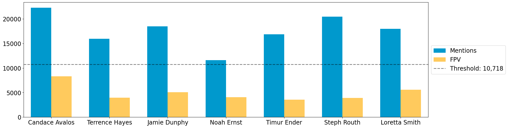
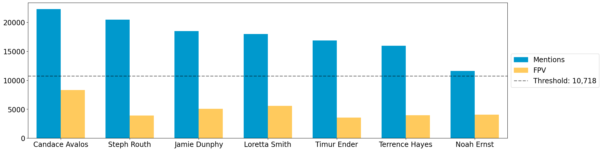

Portland Case Study
===================

In November 2022, voters in Portland, Oregon approved an overhaul to
their system of election. Previously, Portland had a commission model,
with four councillors elected at-large, plus the mayor as a member of
the council. In that system, candidates ran for numbered seats—for
instance “City Commissioner Position 4”—for which the whole city voted.
The new system holds the mayor separate and expands to 12 seats, with
four geographical districts electing three councillors each through
ranked-choice voting.

The precise system of election now in place is called STV or “single
transferable vote”; support from roughly a quarter of the district’s
voters is the threshold required for election. Voters can rank up to six
candidates, and rounds of tabulation are conducted with support
transferring down the ballot until three candidates cross the threshold.

The Data and Democracy Lab released a report studying the election, in
particular the mechanics of the STV election to explain that the voting
system played a direct role in securing such strong representation for
communities of color. You can read the report
`here. <https://mggg.org/ppm>`__ In this tutorial notebook, we show how
VoteKit can be used to replicate the analysis done in the report. For a
more thorough replication repository, you can visit `this GitHub
repo. <https://github.com/mggg/Portland-Postmortem>`__

Cast Vote Record (CVR)
----------------------

The city of Portland released the cast vote record (CVR) for the
election in a format that reflected the scantron style ballot. Each
voter was given a row in a table, and each candidate was given 6
columns, one for each ranking position. A vote for a candidate in
position i was recorded as a 1 in that candidate’s “Ranking i” column,
and 0 otherwise. This allows for the possiblity of overvotes—multiple
candidates can have a 1 in their “Ranking i” column— and skips—no
candidate has a 1 in their “Ranking i” column. In order to make this
format readable by VoteKit, we need to transform it so that there are
only 6 columns total. Each column represents one position of a ranking,
and the entry of that column is the candidate ranked in that position.

In addition to this format, the city also released the data by district,
but included every voter from the entire city in each data set. So we
will have to scrub the voters that are from the other 3 districts.

If you want to skip all of the cleaning steps below, you can download
the prepared data
`here <https://github.com/mggg/VoteKit/blob/main/notebooks/Portland_D1_cleaned_votekit_pref_profile.csv>`__.
Save the csv file in the same working directory as your Python notebook.

Cleaning the data and analyzing voter errors
--------------------------------------------

First, we will read in the csv of the cast vote record, scrub the
non-district 1 voters, and create new columns that match the format
needed by VoteKit. `Here is a
link <https://multco.us/info/turnout-and-statistics-november-2024-general-election>`__
to the csv. You will want the “Councilor District 1 Cast Vote Record
Data”. Alternatively, we can use a package called ``gdown`` to download
the data from the Google Drive folder that Portland stored it in. Or you
can download it from our
`GitHub <https://github.com/mggg/VoteKit/blob/main/notebooks/Portland_D1_raw_from_city.csv>`__,
where it is called ``"Portland_D1_raw_from_city.csv"``.

After that, we will use VoteKit to perform the rest of the cleaning.

.. code:: ipython3

    import pandas as pd
    import gdown
    
    file_id = "1ly3IcjeQTpet-zvxd49DM_OmY_i4uftB"
    url = f"https://drive.google.com/uc?id={file_id}"
    save_to = "Portland_D1_raw_from_city.csv"
    
    gdown.download(url, save_to, quiet=False)

.. parsed-literal::

    Downloading...
    From: https://drive.google.com/uc?id=1ly3IcjeQTpet-zvxd49DM_OmY_i4uftB
    To: /Users/cdonnay/Documents/GitHub/MGGG/VoteKit/notebooks/Portland_D1_raw_from_city.csv
    100%|██████████| 104M/104M [00:04<00:00, 23.7MB/s] 

.. parsed-literal::

    'Portland_D1_raw_from_city.csv'

.. code:: ipython3

    D1_df = pd.read_csv(save_to) 
    # D1_df = pd.read_csv("file_name.csv") # if you downloaded the file directly, uncomment this and insert the file name
    D1_df.head()

.. raw:: html

    

    
    <table border="1" class="dataframe">
      <thead>
        <tr style="text-align: right;">
          <th></th>
          <th>RowNumber</th>
          <th>BoxID</th>
          <th>BoxPosition</th>
          <th>BallotID</th>
          <th>PrecinctID</th>
          <th>BallotStyleID</th>
          <th>PrecinctStyleName</th>
          <th>ScanComputerName</th>
          <th>Status</th>
          <th>Remade</th>
          <th>...</th>
          <th>Choice_122_1:City of Portland, Councilor, District 1:3:Number of Winners 3:Write-in-122:NON</th>
          <th>Choice_122_1:City of Portland, Councilor, District 1:4:Number of Winners 3:Write-in-122:NON</th>
          <th>Choice_122_1:City of Portland, Councilor, District 1:5:Number of Winners 3:Write-in-122:NON</th>
          <th>Choice_122_1:City of Portland, Councilor, District 1:6:Number of Winners 3:Write-in-122:NON</th>
          <th>Choice_50003_1:City of Portland, Councilor, District 1:1:Number of Winners 3:Uncertified Write In:NON</th>
          <th>Choice_50003_1:City of Portland, Councilor, District 1:2:Number of Winners 3:Uncertified Write In:NON</th>
          <th>Choice_50003_1:City of Portland, Councilor, District 1:3:Number of Winners 3:Uncertified Write In:NON</th>
          <th>Choice_50003_1:City of Portland, Councilor, District 1:4:Number of Winners 3:Uncertified Write In:NON</th>
          <th>Choice_50003_1:City of Portland, Councilor, District 1:5:Number of Winners 3:Uncertified Write In:NON</th>
          <th>Choice_50003_1:City of Portland, Councilor, District 1:6:Number of Winners 3:Uncertified Write In:NON</th>
        </tr>
      </thead>
      <tbody>
        <tr>
          <th>0</th>
          <td>1</td>
          <td>RCV-0001</td>
          <td>1</td>
          <td>RCV-0001+10003</td>
          <td>26</td>
          <td>3</td>
          <td>4506-1</td>
          <td>ScanStation6</td>
          <td>0</td>
          <td>0</td>
          <td>...</td>
          <td>0</td>
          <td>0</td>
          <td>0</td>
          <td>0</td>
          <td>0</td>
          <td>0</td>
          <td>0</td>
          <td>0</td>
          <td>0</td>
          <td>0</td>
        </tr>
        <tr>
          <th>1</th>
          <td>2</td>
          <td>RCV-0001</td>
          <td>2</td>
          <td>RCV-0001+10005</td>
          <td>32</td>
          <td>1</td>
          <td>2804-1</td>
          <td>ScanStation6</td>
          <td>0</td>
          <td>0</td>
          <td>...</td>
          <td>0</td>
          <td>0</td>
          <td>0</td>
          <td>0</td>
          <td>0</td>
          <td>0</td>
          <td>0</td>
          <td>0</td>
          <td>0</td>
          <td>0</td>
        </tr>
        <tr>
          <th>2</th>
          <td>3</td>
          <td>RCV-0001</td>
          <td>3</td>
          <td>RCV-0001+10007</td>
          <td>53</td>
          <td>1</td>
          <td>3303-1</td>
          <td>ScanStation6</td>
          <td>0</td>
          <td>0</td>
          <td>...</td>
          <td>0</td>
          <td>0</td>
          <td>0</td>
          <td>0</td>
          <td>0</td>
          <td>0</td>
          <td>0</td>
          <td>0</td>
          <td>0</td>
          <td>0</td>
        </tr>
        <tr>
          <th>3</th>
          <td>4</td>
          <td>RCV-0001</td>
          <td>4</td>
          <td>RCV-0001+10009</td>
          <td>22</td>
          <td>1</td>
          <td>4105-1</td>
          <td>ScanStation6</td>
          <td>0</td>
          <td>0</td>
          <td>...</td>
          <td>0</td>
          <td>0</td>
          <td>0</td>
          <td>0</td>
          <td>0</td>
          <td>0</td>
          <td>0</td>
          <td>0</td>
          <td>0</td>
          <td>0</td>
        </tr>
        <tr>
          <th>4</th>
          <td>5</td>
          <td>RCV-0001</td>
          <td>5</td>
          <td>RCV-0001+10011</td>
          <td>53</td>
          <td>1</td>
          <td>3303-1</td>
          <td>ScanStation6</td>
          <td>0</td>
          <td>0</td>
          <td>...</td>
          <td>0</td>
          <td>0</td>
          <td>0</td>
          <td>0</td>
          <td>0</td>
          <td>0</td>
          <td>0</td>
          <td>0</td>
          <td>0</td>
          <td>0</td>
        </tr>
      </tbody>
    </table>
    
5 rows × 130 columns

    

.. code:: ipython3

    # stores all columns that have ranking information
    rank_columns = {i:[col for col in D1_df.columns if f'{i}:Number' in col] for i in range(1,7)}
    all_rank_cols = [col for col_list in rank_columns.values() for col in col_list]

The code below scrubs any voter who did not cast at least one vote,
which in turn removes any voter not from district 1.

.. code:: ipython3

    D1_voters_df = D1_df[D1_df[all_rank_cols].sum(axis=1) > 0].reset_index(drop=True) # just resets the index of the df

We now add the new ranking columns that match the VoteKit format.

In the process, we will lose some information about overvotes, when
voters put more than one candidate in a ranking.

.. code:: ipython3

    ranking_data = {i:[-1 for _ in range(len(D1_voters_df))] for i in range(1,7)}
    
    for voter_index, row in D1_voters_df.iterrows():
        for rank_position in range(1,7):
            num_votes_cast = row[rank_columns[rank_position]].sum()
    
            if num_votes_cast == 0:
                cast_vote = ""
            
            elif num_votes_cast > 1:
                cast_vote = "overvote"
    
                # here we lost knowledge of who was in the overvote. That's how Portland runs their election
                # system, but it could be interesting to study who is in the overvote!
    
            else:
                # find candidate name from column
                pd_series = row[rank_columns[rank_position]]
                cast_vote_column_name = pd_series.loc[pd_series == 1].index.tolist()[0]
                cast_vote = cast_vote_column_name.split(":")[-2]
    
            ranking_data[rank_position][voter_index] = cast_vote 
    
    # add the new columns
    for rank_position in range(1,7):
        D1_voters_df[f"Rank {rank_position}"] = ranking_data[rank_position]

.. code:: ipython3

    D1_voters_df.head()

.. raw:: html

    

    
    <table border="1" class="dataframe">
      <thead>
        <tr style="text-align: right;">
          <th></th>
          <th>RowNumber</th>
          <th>BoxID</th>
          <th>BoxPosition</th>
          <th>BallotID</th>
          <th>PrecinctID</th>
          <th>BallotStyleID</th>
          <th>PrecinctStyleName</th>
          <th>ScanComputerName</th>
          <th>Status</th>
          <th>Remade</th>
          <th>...</th>
          <th>Choice_50003_1:City of Portland, Councilor, District 1:3:Number of Winners 3:Uncertified Write In:NON</th>
          <th>Choice_50003_1:City of Portland, Councilor, District 1:4:Number of Winners 3:Uncertified Write In:NON</th>
          <th>Choice_50003_1:City of Portland, Councilor, District 1:5:Number of Winners 3:Uncertified Write In:NON</th>
          <th>Choice_50003_1:City of Portland, Councilor, District 1:6:Number of Winners 3:Uncertified Write In:NON</th>
          <th>Rank 1</th>
          <th>Rank 2</th>
          <th>Rank 3</th>
          <th>Rank 4</th>
          <th>Rank 5</th>
          <th>Rank 6</th>
        </tr>
      </thead>
      <tbody>
        <tr>
          <th>0</th>
          <td>54</td>
          <td>RCV-0001</td>
          <td>54</td>
          <td>RCV-0001+10109</td>
          <td>35</td>
          <td>2</td>
          <td>4703-1</td>
          <td>ScanStation6</td>
          <td>0</td>
          <td>0</td>
          <td>...</td>
          <td>0</td>
          <td>0</td>
          <td>0</td>
          <td>0</td>
          <td>Terrence Hayes</td>
          <td>Loretta Smith</td>
          <td>Noah Ernst</td>
          <td></td>
          <td></td>
          <td></td>
        </tr>
        <tr>
          <th>1</th>
          <td>58</td>
          <td>RCV-0001</td>
          <td>58</td>
          <td>RCV-0001+10117</td>
          <td>20</td>
          <td>2</td>
          <td>4508-1</td>
          <td>ScanStation6</td>
          <td>0</td>
          <td>0</td>
          <td>...</td>
          <td>0</td>
          <td>0</td>
          <td>0</td>
          <td>0</td>
          <td>Loretta Smith</td>
          <td>Steph Routh</td>
          <td>Timur Ender</td>
          <td>David Linn</td>
          <td>Candace Avalos</td>
          <td>Jamie Dunphy</td>
        </tr>
        <tr>
          <th>2</th>
          <td>59</td>
          <td>RCV-0001</td>
          <td>59</td>
          <td>RCV-0001+10119</td>
          <td>20</td>
          <td>2</td>
          <td>4508-1</td>
          <td>ScanStation6</td>
          <td>0</td>
          <td>0</td>
          <td>...</td>
          <td>0</td>
          <td>0</td>
          <td>0</td>
          <td>0</td>
          <td>Loretta Smith</td>
          <td>Steph Routh</td>
          <td>Timur Ender</td>
          <td>David Linn</td>
          <td>Candace Avalos</td>
          <td>Jamie Dunphy</td>
        </tr>
        <tr>
          <th>3</th>
          <td>124</td>
          <td>RCV-0001</td>
          <td>124</td>
          <td>RCV-0001+10249</td>
          <td>9</td>
          <td>2</td>
          <td>4802-1</td>
          <td>ScanStation6</td>
          <td>0</td>
          <td>0</td>
          <td>...</td>
          <td>0</td>
          <td>0</td>
          <td>0</td>
          <td>0</td>
          <td>Michael (Mike) Sands</td>
          <td>Doug Clove</td>
          <td>Joe Furi</td>
          <td>Timur Ender</td>
          <td>Deian Salazar</td>
          <td>Loretta Smith</td>
        </tr>
        <tr>
          <th>4</th>
          <td>199</td>
          <td>RCV-0002</td>
          <td>11</td>
          <td>RCV-0002+10023</td>
          <td>39</td>
          <td>2</td>
          <td>4707-1</td>
          <td>ScanStation8</td>
          <td>0</td>
          <td>0</td>
          <td>...</td>
          <td>0</td>
          <td>0</td>
          <td>0</td>
          <td>0</td>
          <td>Timur Ender</td>
          <td>Candace Avalos</td>
          <td>Cayle Tern</td>
          <td>Steph Routh</td>
          <td>Michael (Mike) Sands</td>
          <td>Jamie Dunphy</td>
        </tr>
      </tbody>
    </table>
    
5 rows × 136 columns

    

.. code:: ipython3

    D1_voters_df[[f"Rank {rank_position}" for rank_position in range(1,7)]].to_csv("Portland_D1_raw_votekit_format.csv")

Now that the csv is in the correct format for VoteKit, we can complete
our cleaning using VoteKit’s built in cleaning tools.

.. code:: ipython3

    from votekit.cvr_loaders import load_ranking_csv
    
    profile = load_ranking_csv("Portland_D1_raw_votekit_format.csv", rank_cols=[1,2,3,4,5,6], header_row=0)

.. parsed-literal::

    RankProfile
    Maximum ranking length: 6
    Candidates: ('Write-in-121', 'overvote', 'Write-in-122', 'David Linn', 'Terrence Hayes', 'Noah Ernst', 'Thomas Shervey', 'Joe Furi', 'Uncertified Write In', 'Loretta Smith', 'Michael (Mike) Sands', 'Steph Routh', 'Joe Allen', 'Write-in-120', 'Jamie Dunphy', 'Peggy Sue Owens', 'Deian Salazar', 'Cayle Tern', 'Timur Ender', 'Candace Avalos', 'Doug Clove')
    Candidates who received votes: ('Write-in-121', 'overvote', 'Write-in-122', 'David Linn', 'Terrence Hayes', 'Noah Ernst', 'Thomas Shervey', 'Joe Furi', 'Uncertified Write In', 'Loretta Smith', 'Michael (Mike) Sands', 'Steph Routh', 'Joe Allen', 'Write-in-120', 'Jamie Dunphy', 'Peggy Sue Owens', 'Deian Salazar', 'Cayle Tern', 'Timur Ender', 'Candace Avalos', 'Doug Clove')
    Total number of Ballot objects: 43669
    Total weight of Ballot objects: 43669.0
    

Notice above that there are two different stats about the ballots:
number of total ballots and the total weight. The number of ballots
counts the number of ``Ballot`` objects in the profile, while the total
weight sums the ``weight`` of all of them. In this case, they are the
same since each ballot had weight 1, but in general this does not need
to be the case. We need to be careful and sum the ballot weights, not
the number of ballots, if we want to know the total number of voters.

We will take this moment to analyze how many overvotes occurred in first
place, as well as how many occurred anywhere on the ballot.

.. code:: ipython3

    num_ballots_cast = profile.total_ballot_wt
    
    num_overvotes_first_place = sum(b.weight for b in profile.ballots if b.ranking[0] == {"overvote"})
    num_ballots_with_overvotes = sum(b.weight for b in profile.ballots if any(cand_set == {"overvote"} for cand_set in b.ranking))
    
    print(f"There were {num_overvotes_first_place} overvotes in first place, or {num_overvotes_first_place/num_ballots_cast:.1%} of the ballots.")
    print(f"There were {num_ballots_with_overvotes} ballots with overvotes in any place, or {num_ballots_with_overvotes/num_ballots_cast:.1%} of the ballots.")

.. parsed-literal::

    There were 906.0 overvotes in first place, or 2.1% of the ballots.
    There were 1474.0 ballots with overvotes in any place, or 3.4% of the ballots.

In the rules of Portland’s election, which you can find
`here <https://www.portland.gov/transition/portland-transition-election-code/ranked-choice-voting-election-code>`__,
any skipped positions and overvotes are ignored by the STV algorithm,
and any candidates that were ranked below the position are moved up. The
same thing occurs to three of the write in categories, but oddly enough,
not to the “Uncertified Write-in” category.

While Portland did not alter the ballots themselves, but rather told the
STV algorithm how to ignore ballot errors, this is mathematically
equvalent to pre-processing the ballots. VoteKit’s
``remove_and_condense_rank_profile`` function removes candidates and
then condenses any ballot positions left empty after scrubbing the given
candidates.

We will take this moment to also analyze spoilage. We call a ballot
“spoiled” if it is removed during the cleaning process. We will record
the percentage of ballots that are spoiled.

.. code:: ipython3

    from votekit.cleaning import remove_and_condense_rank_profile
    
    cleaned_profile_1 = remove_and_condense_rank_profile("overvote", profile)
    
    num_ballots_spoiled_by_ov_skips = num_ballots_cast - cleaned_profile_1.total_ballot_wt 
    print(f"{num_ballots_spoiled_by_ov_skips} ballots, or {num_ballots_spoiled_by_ov_skips/num_ballots_cast:.1%} of all ballots, were spoiled by overvotes or skips in D1.")
    
    cleaned_profile_2 = remove_and_condense_rank_profile(['Write-in-120', 'Write-in-121', 'Write-in-122'], cleaned_profile_1)
    
    num_ballots_scrubbed_by_wi = num_ballots_cast - num_ballots_spoiled_by_ov_skips-cleaned_profile_2.total_ballot_wt 
    print(f"{num_ballots_scrubbed_by_wi} ballots, or {num_ballots_scrubbed_by_wi/num_ballots_cast:.1%} of all ballots, were scrubbed by write ins in D1.")

.. parsed-literal::

    712.0 ballots, or 1.6% of all ballots, were spoiled by overvotes or skips in D1.
    86.0 ballots, or 0.2% of all ballots, were scrubbed by write ins in D1.

We also have to handle one more item of cleaning. It is entirely
possible that a voter listed the same candidate more than once on their
ballot, which is not allowed. Portland chose to keep the first
occurrence, and ignore any later occurrences, condensing any positions
left empty as a result.

.. code:: ipython3

    from votekit.cleaning import remove_repeat_cands_rank_profile, condense_rank_profile
    
    cleaned_profile_3 = condense_rank_profile(remove_repeat_cands_rank_profile(cleaned_profile_2))

Now to compute the adjusted and tabulated rate, which is the percentage
of ballots that were touched by a cleaning rule but still used in the
final tabulation. To do this we use the ``CleanedProfile`` class, which
keeps track of the previous profile before a cleaning step, as well as
which ballots were altered along the way.

.. code:: ipython3

    def find_all_parents(profile):
        """
        Find all of the parent profiles of a CleanedProfile. 
        Returns a list, where the first entry is the input profile, and the last entry is the original
        pre-cleaned profile.
        """
        if hasattr(profile, "parent_profile"):
            return [profile] + find_all_parents(profile.parent_profile)
        
        return [profile]
    
    def adjusted_and_tabulated(profile):
        """
        Compute the number of ballots that were adjusted by a cleaning rule but eventually used in the
        tabulation.
        """ 
        adj_idxs = set().union(*[p.nonempty_altr_idxs for p in find_all_parents(profile)[:-1]])
    
        adj_and_tab_idxs = list(adj_idxs.intersection(profile.df.index))
    
        return sum(profile.df.loc[adj_and_tab_idxs, "Weight"])
    
    
    num_adj_and_tabulated = adjusted_and_tabulated(cleaned_profile_3)
    print(f"{num_adj_and_tabulated} ballots, or {num_adj_and_tabulated/num_ballots_cast:.2%} of all ballots, were adjusted before tabulation in D1.")
    

.. parsed-literal::

    2507.0 ballots, or 5.74% of all ballots, were adjusted before tabulation in D1.

Finally, the profile is cleaned and we can save it for analysis. We save
it as a csv file.

.. code:: ipython3

    cleaned_profile_3.to_csv("Portland_D1_cleaned_votekit_pref_profile.csv")
    print(f"After cleaning, there are now {cleaned_profile_3.total_ballot_wt:,} ballots.")

.. parsed-literal::

    After cleaning, there are now 42,871.0 ballots.

Analysis
--------

Finally, we have a CVR that is cleaned and ready to be analyzed. If you
skipped all of the cleaning steps above, you can download the prepared
data
`here <https://github.com/mggg/VoteKit/blob/main/notebooks/Portland_D1_cleaned_votekit_pref_profile.csv>`__.
Save the csv file in the same working directory as your Python notebook.

The first thing we should do is verify that our data and outcome matches
that of the official election.

.. code:: ipython3

    from votekit.pref_profile import RankProfile
    profile = RankProfile.from_csv("Portland_D1_cleaned_votekit_pref_profile.csv")

Do we have the correct candidates? Do we have the same vote totals? Do
we get the same STV winner set? In district 1, Avalos, Dunphy, and Smith
were elected. The winners, first place vote distribution, and lots of
other stats we can double check, are given
`here <https://www.portland.gov/sites/default/files/2024/Portland-District-1-Certified-Abstract-Nov-2024.pdf>`__.

.. code:: ipython3

    from votekit.elections import STV
    from votekit.utils import first_place_votes
    
    
    # 3 seat election
    election = STV(profile, m=3)
    print("Winners in order of election")
    i=0
    for cand_set in election.get_elected():
        for cand in cand_set:
            i+=1
            print(i, cand)
    
    # threshold
    print("\nThreshold: ", election.threshold, "\n")
    
    fpv_dict = first_place_votes(profile)
    cands_sorted_by_fpv = sorted(zip(fpv_dict.keys(), fpv_dict.values()), # creates a list of tuples, (name, fpv)
                                    reverse=True,  #decreasing order
                                    key = lambda x: x[1], # sort by second element of tuple, which is fpv)
                                        )
    
    print("Candidates in decreasing order of first place votes.\n")
    for cand, fpv in cands_sorted_by_fpv:
        print(cand, fpv)

.. parsed-literal::

    Winners in order of election
    1 Candace Avalos
    2 Loretta Smith
    3 Jamie Dunphy
    
    Threshold:  10718 
    
    Candidates in decreasing order of first place votes.
    
    Candace Avalos 8297.0
    Loretta Smith 5586.0
    Jamie Dunphy 5064.0
    Noah Ernst 4052.0
    Terrence Hayes 3975.0
    Steph Routh 3894.0
    Timur Ender 3550.0
    Doug Clove 1698.0
    Peggy Sue Owens 1266.0
    David Linn 1111.0
    Joe Allen 978.0
    Michael (Mike) Sands 952.0
    Deian Salazar 720.0
    Cayle Tern 711.0
    Thomas Shervey 385.0
    Joe Furi 355.0
    Uncertified Write In 277.0

Take a moment to verify these against the `official
record <https://www.portland.gov/sites/default/files/2024/Portland-District-1-Certified-Abstract-Nov-2024.pdf>`__.

Candidate Statistics
--------------------

Viable Candidates
~~~~~~~~~~~~~~~~~

Portland had a LOT of candidates running. District 1 had 16 named
candidates and a handful of write ins.

We choose to categorize the candidates as viable and non-viable in order
to focus the scale of our analysis. A viable candidate is one that
received at least as many mentions as the STV threshold. We call them
viable because this is a necessary condition to win.

(Well, technically it is possible for a non-viable candidate to win by
being the last person standing after eliminations, but it is an edge
case and does not occur in Portland. Only viable candidates win across
all four districts.)

First, let’s plot the candidate mentions, along with the threshold for
election.

.. code:: ipython3

    from votekit.plots import profile_mentions_plot
    
    ax = profile_mentions_plot(profile, 
                                threshold_values=election.threshold, 
                                threshold_kwds={"label": f"Threshold: {election.threshold:,}", 
                                            "color":"black", 
                                            "linestyle": "--"},
                                show_profile_legend=True)

Well the candidate names are too long to fit on the axis, so let’s
relabel them.

.. code:: ipython3

    ax = profile_mentions_plot(profile, 
                                threshold_values=election.threshold, 
                                threshold_kwds={"label": f"Threshold: {election.threshold:,}", 
                                            "color":"black", 
                                            "linestyle": "--"},
                                show_profile_legend=True,
                                relabel_candidates_with_int=True)

We now see visually who is viable: Avalos, Routh, Dunphy, Smith, Ender,
Hayes, and Ernst.

To determine the viable candidates Pythonically, you can do the
following.

.. code:: ipython3

    from votekit.utils import mentions
    
    mentions_dict = mentions(profile)
    viable_cands = [c for c, mentions in mentions_dict.items() if mentions >= election.threshold]
    
    viable_cands = sorted(viable_cands, reverse=True, key = lambda x: mentions_dict[x])
    print("Viable candidates in decreasing order of mentions")
    
    for i, cand in enumerate(viable_cands):
        print(i+1, cand)

.. parsed-literal::

    Viable candidates in decreasing order of mentions
    1 Candace Avalos
    2 Steph Routh
    3 Jamie Dunphy
    4 Loretta Smith
    5 Timur Ender
    6 Terrence Hayes
    7 Noah Ernst

Let’s also plot their first place votes, next to their mentions. After
all, STV is based on first place votes, and this can help explain the
winner set we observe. To make a plot this customized, we have to do a
bit more work and expose the underlying function that
``profile_mentions_plot`` is a wrapper for.

.. code:: ipython3

    from votekit.plots import multi_bar_plot
    
    viable_cands_mentions = {cand:mentions for cand, mentions in mentions_dict.items() if cand in viable_cands}
    viable_cands_fpv = {cand: fpv for cand, fpv in first_place_votes(profile).items() if cand in viable_cands}
    
    ax = multi_bar_plot({"Mentions": viable_cands_mentions, "FPV": viable_cands_fpv},  
                                threshold_values=election.threshold, 
                                threshold_kwds={"label": f"Threshold: {election.threshold:,}", 
                                            "color":"black", 
                                            "linestyle": "--"},
                        )

Whoops, the candidates are not in our desired order. This is also easy
to fix by adding the ``candidate_ordering`` parameter.

.. code:: ipython3

    ax = multi_bar_plot({"Mentions": viable_cands_mentions, "FPV": viable_cands_fpv},
                        category_ordering = viable_cands,
                        threshold_values=election.threshold, 
                        threshold_kwds={"label": f"Threshold: {election.threshold:,}", 
                                            "color":"black", 
                                            "linestyle": "--"},
    )

We see that part of the reason Routh was not elected is that he has
significantly less FPV support than Dunphy and Smith, who were elected.

Dominating Tiers
~~~~~~~~~~~~~~~~

A dominating tier of candidates is a set of candidates that beat all
other candidates in lower tiers in head to head comparisons. If there is
a unique member of the highest tier, i.e. a candidate that beats all
other candidates head to head, they are called the Condorcet winner, or
Condorcet candidate.

In Portland, all four districts have Condorcet candidates—and in fact
all four districts have a Condorcet order on their viable candidates.
Interestingly, District 3 also contains what is known as a Condorcet
cycle: three non-viable candidates (Knab, Wanner, Azul Otero) receive
conflicting head-to-head support from voters. Wanner is preferred to
Knab 18,021 to 17,658; Knab is preferred to Azul Otero 16,415 to 12,225;
but Azul Otero is narrowly preferred to Wanner, 18,602 to 18,289.

To compute dominating tiers, we do the following.

.. code:: ipython3

    from votekit.graphs import PairwiseComparisonGraph
    
    pwcg = PairwiseComparisonGraph(profile)
    dominating_tiers = pwcg.get_dominating_tiers()
    
    print("The dominating tiers are: ")
    for tier in dominating_tiers:
        print(tier)
    
    if pwcg.has_condorcet_winner():
        print(f"\nThe Condorcet candidate is: {next(iter(dominating_tiers[0]))}")
    else:
        print(f"\n There is no unique Condorcet winner. The top tier is {dominating_tiers[0]}")

.. parsed-literal::

    The dominating tiers are: 
    {'Candace Avalos'}
    {'Steph Routh'}
    {'Jamie Dunphy'}
    {'Loretta Smith'}
    {'Timur Ender'}
    {'Terrence Hayes'}
    {'Noah Ernst'}
    {'Cayle Tern'}
    {'David Linn'}
    {'Doug Clove'}
    {'Michael (Mike) Sands'}
    {'Deian Salazar'}
    {'Joe Allen'}
    {'Joe Furi'}
    {'Peggy Sue Owens'}
    {'Thomas Shervey'}
    {'Uncertified Write In'}
    
    The Condorcet candidate is: Candace Avalos

Candidate Similarity
~~~~~~~~~~~~~~~~~~~~

Finally, we can plot a collection of matrices that tell us something
about the relationship between candidates. The three kinds of matrices
are: boost, candidate distance, and comentions.

The (i,j) entry of the boost matrix shows P(mention i \| mention j) -
P(mention i). Thus, the i,j entry shows the boost given to candidate i
by candidate j.

.. code:: ipython3

    from votekit.matrices import matrix_heatmap, boost_matrix, candidate_distance_matrix, comentions_matrix
    
    all_cands_sorted_by_mentions = sorted(profile.candidates, reverse=True, key = lambda x: mentions_dict[x])
    
    # computes the matrix
    bm  = boost_matrix(profile, candidates = all_cands_sorted_by_mentions)

.. code:: ipython3

    all_last_names = [name.split(" ")[-1] if "Write In" not in name 
                                            else "UWI" 
                                            for name in all_cands_sorted_by_mentions]
    
    # plots the matrix
    ax  = matrix_heatmap(bm, row_labels=all_last_names, 
                            column_labels=all_last_names,
                            row_label_rotation = 0,
                            column_label_rotation = 90)

Since there are so many candidates, we should adjust the figure size and
maybe the font size as well.

.. code:: ipython3

    import matplotlib.pyplot as plt
    
    fig, ax = plt.subplots(figsize=(12,12))
    
    ax  = matrix_heatmap(bm, row_labels=all_last_names, 
                            column_labels=all_last_names,
                            row_label_rotation = 0,
                            column_label_rotation = 90,
                            ax = ax,
                            cell_font_size = 12)

The matrix heatmap uses a scale from purple to green, where dark purple
means more negative, and dark green means more positive. Let’s examine a
few entries.

The (Routh, Dunphy) entry is the largest positive value (0.22). This
means that you were 22% more likely to rank Routh on your ballot if you
ranked Dunphy. The corresponding entry (Dunphy, Routh) is also strongly
positive at 0.20, which means that Routh and Dunphy received support
from the same voters.

The (Avalos, Ernst) entry is by far the most negative at -0.18. This
means that if you ranked Ernst, you were less likely to rank Avalos. The
corresponding entry (Ernst, Avalos) is -0.09, so voters who ranked
Avalos were less likely to rank Ernst, although to a lesser degree. This
indicates distinct support bases for the two candidates.

Here are the other two matrices, which we will define but not discuss.

The (i,j) entry of the candidate distance matrix shows the average
distance between candidates i and j when i >= j on the same ballot.

.. code:: ipython3

    cdm  = candidate_distance_matrix(profile, candidates = viable_cands)
    
    last_names_viable = [name.split(" ")[-1] for name in viable_cands]
    
    ax  = matrix_heatmap(cdm, row_labels=last_names_viable, 
                            column_labels=last_names_viable,
                            row_label_rotation = 0,
                            column_label_rotation = 90)

.. image:: 7_portland_case_study_files/7_portland_case_study_56_0.png

Finally, the (i,j) entry of the comentions matrix shows the number of
times candidates i,j were mentioned on the same ballot with i >= j.
There is an option to symmetrize the matrix, which makes the (i,j) entry
the number of times that i and j were mentioned on the same ballot
(irrespective of position).

.. code:: ipython3

    cmm_asym  = comentions_matrix(profile, candidates = viable_cands)
    ax  = matrix_heatmap(cmm_asym, row_labels=last_names_viable, 
                            column_labels=last_names_viable,
                            row_label_rotation = 0,
                            column_label_rotation = 90, 
                            n_decimals_to_display=0)
    
    plt.title("Asymmetric Comentions") 
    plt.show()

.. code:: ipython3

    cmm_sym  = comentions_matrix(profile, candidates = viable_cands, symmetric=True)
    ax  = matrix_heatmap(cmm_sym, row_labels=last_names_viable, 
                            column_labels=last_names_viable,
                            row_label_rotation = 0,
                            column_label_rotation = 90,
                            n_decimals_to_display=0) 
    
    plt.title("Symmetric Comentions")
    plt.show()

Voter Behavior
--------------

Ballot Length
~~~~~~~~~~~~~

We can look at the patterns of ballot length, or the number of
candidates ranked. In other real-world ranked choice elections, like
Scotland, when voters are ranking candidates to fill m seats, the most
common ballot length is m, and typically the next most common behavior
is to rank all available candidates. It is natural to interpret a ballot
ranking exactly m candidates with an expression of the voter’s preferred
winner set.

.. code:: ipython3

    from votekit.plots import profile_ballot_lengths_plot
    import matplotlib.pyplot as plt
    
    ax = profile_ballot_lengths_plot(profile, title="Ballot Lengths in D1", normalize=True, y_axis_name="Percentage", x_axis_name="Length")
    
    # change the tick labels to percentages
    ax.set_yticks(ax.get_yticks())
    ax.set_yticklabels([f"{float(x.get_text()):.0%}" for x in ax.get_yticklabels()])
    
    plt.show()

Portland D1 voters did a great job casting complete ballots: almost 40%
of them were complete, and less than 15% of them were bullet votes for a
single person.

Some observers worried that minority communities might be more likely to
vote short ballots. One way to get a vantage point on that is to
consider whether ballots with a first-choice vote for a candidate of
color look different in terms of their overall length. However, the
identity of the top choice seems to make no meaningful difference in the
ballot length pattern.

We use the self-identified race of each candidate to determine if they
are a candidate of color. 4 of the 16 candidates did not identify, and
we have chosen to categorize them as non-POC. You can change one line
below to categorize them as POC, and note that this does not change the
results meaningfully.

.. code:: ipython3

    from votekit.pref_profile import PreferenceProfile
    from votekit.plots import multi_profile_ballot_lengths_plot
    
    d1_candidate_to_race = {
        'Noah Ernst': 'White',
        'Joe Allen':'White',
        'Terrence Hayes': 'Black',
        'David Linn':'White',
        'Jamie Dunphy': 'White',
        'Steph Routh': 'White',
        'Peggy Sue Owens': 'White',
        'Loretta Smith': 'Black',
        'Timur Ender': 'White',
        'Doug Clove': 'White',
        'Candace Avalos': 'Black/Latina',
        'Cayle Tern': 'Asian'
    }
    
    missing_race_classify = "White" # change this to non-White to see how classify the 4 cands with missing race
    # differently would change the analysis
    
    w_ballots = [b for b in profile.ballots if d1_candidate_to_race.get(next(iter(b.ranking[0])), missing_race_classify) == "White"]
    poc_ballots = [b for b in profile.ballots if d1_candidate_to_race.get(next(iter(b.ranking[0])), missing_race_classify) != "White"]
    
    sub_profile_w = PreferenceProfile(ballots=w_ballots)
    sub_profile_poc = PreferenceProfile(ballots = poc_ballots)
    
    ax = multi_profile_ballot_lengths_plot({"POC Rank 1": sub_profile_poc, "non-POC Rank 1": sub_profile_w}, 
                                           show_profile_legend=True, normalize=True,
                                           y_axis_name="Percentage",
                                           title = "Ballot Lengths in D1 by Rank 1 Race",
                                           x_axis_name="Length")
    
    # change the tick labels to percentages
    ax.set_yticks(ax.get_yticks())
    ax.set_yticklabels([f"{float(x.get_text()):.0%}" for x in ax.get_yticklabels()])
    
    plt.show()

Ballot Exhaustion
~~~~~~~~~~~~~~~~~

In a ranked-choice election which unfolds round by round, a ballot is
often called exhausted if the ballot is not used in the final round of
meaningful tabulation. Here in District 1, Candace Avalos crosses
threshold in Round 13, and those ranking Avalos first have some surplus
weight transferred to their next choice. Round 15 is the last round of
tabulation before the winners are confirmed, when Dunphy, Hayes, and
Smith are still in contention for the two remaining seats. Thus, in
District 1, for a ballot to not be considered exhausted, it must include
at least one of these three candidates.

In single-winner ranked-choice elections, exhausted ballots are often
viewed as problematic because they do not contribute to the
determination of the winner. In the multi-winner (STV) context, this
makes less sense. For example, consider a District 1 voter who
bullet-votes for Avalos versus a voter who bullet-votes for Smith. The
former ballot is considered exhausted (be- cause Avalos is elected
early) while the latter is not. But the Avalos bullet voter may be
completely satisfied with the outcome. For this reason, we find it
useful to nuance the idea of ballot exhaustion by offering other, more
interpretable measures.

Active rate: How many ballots were still active when the last decision
was made?

.. code:: ipython3

    from votekit.elections import STV
    from votekit.pref_profile import RankProfile, PreferenceProfile
    profile = RankProfile.from_csv("Portland_D1_cleaned_votekit_pref_profile.csv")

.. code:: ipython3

    from votekit.ballot import Ballot
    
    deduplicated_ballots = [Ballot(ranking=b.ranking, weight=1) for b in profile.ballots for _ in range(int(b.weight))]
    ballots_with_ids = [Ballot(ranking=b.ranking, voter_set = {f"{i}"}, weight = 1) for i,b in enumerate(deduplicated_ballots)]
    profile_with_ids = PreferenceProfile(ballots=ballots_with_ids)
    election_with_ids = STV(profile_with_ids, m=3)
    
    initial_ballot_count = profile.total_ballot_wt
    
    final_profile = election_with_ids.get_profile(14)
    
    remaining_voters = [voter for b in final_profile.ballots for voter in b.voter_set]
    remaining_count = len(remaining_voters)
    
    print(f"The active rate is {remaining_count/initial_ballot_count:.1%}.")

.. parsed-literal::

    The active rate is 77.0%.

STV exhaustion rate: How many ballots ranked fewer than six candidates,
and did not include any winner or the last candidate eliminated?

Futility rate: How many ballots ranked six candidates, but did not
include any winner or the last candidate eliminated?

.. code:: ipython3

    stv_exhausted = 0
    futile = 0
    
    winners = [c for s in election.get_elected() for c in s]
    last_cand_elim = election.get_eliminated()[0]
    
    relevant_cands = last_cand_elim.union(winners)
    
    for ballot in profile.ballots:
        num_ranked = len(ballot.ranking)
    
        ranked_cands = [c for s in ballot.ranking for c in s]
        num_ranked_rel_cands = len(relevant_cands.intersection(ranked_cands))
    
        if num_ranked_rel_cands == 0:
    
            if num_ranked < 6:
                stv_exhausted+= ballot.weight
            elif num_ranked == 6:
                futile += ballot.weight
    
    
    
    print(f"The STV exhaustion rate in D1 is {stv_exhausted/initial_ballot_count:.1%}.")
    print(f"The futility rate in D1 is {futile/initial_ballot_count:.1%}.")

.. parsed-literal::

    The STV exhaustion rate in D1 is 12.6%.
    The futility rate in D1 is 1.4%.

Comparing to other systems
--------------------------

R-Representation Scores
~~~~~~~~~~~~~~~~~~~~~~~

The r-representation score is a measure of how satisfied the voters are.
Given a set of candidates, the r-represenation score of a profile is the
proportion of voters who ranked at least one of the candidates in one of
the top-r positions of their ballot. Common choices for r include 1, the
number of seats, and the maximum length of a ballot.

Let’s explore these scores for the STV election in Portland, and see how
they differ across other choices of election system.

.. code:: ipython3

    from votekit.representation_scores import r_representation_score, winner_sets_r_representation_scores
    
    stv_winners = [c for s in election.get_elected() for c in s]
    stv_1_representation = r_representation_score(profile, r=1, candidate_list=stv_winners)
    stv_3_representation = r_representation_score(profile, r=3, candidate_list=stv_winners)
    stv_6_representation = r_representation_score(profile, r=6, candidate_list=stv_winners)
    
    print(f"STV 1-representation score for {stv_winners}: {stv_1_representation:.1%}")
    print(f"STV 3-representation score for {stv_winners}: {stv_3_representation:.1%}")
    print(f"STV 6-representation score for {stv_winners}: {stv_6_representation:.1%}")

.. parsed-literal::

    STV 1-representation score for ['Candace Avalos', 'Loretta Smith', 'Jamie Dunphy']: 44.2%
    STV 3-representation score for ['Candace Avalos', 'Loretta Smith', 'Jamie Dunphy']: 70.9%
    STV 6-representation score for ['Candace Avalos', 'Loretta Smith', 'Jamie Dunphy']: 79.6%

So almost 80% of the voters have some winner listed somewhere on their
ballot. That is pretty high satisfaction! Let’s compare that to a few
other election systems.

.. code:: ipython3

    from votekit.elections import CondoBorda, Plurality, Borda
    
    
    alt_elections = {"Condorcet": CondoBorda(profile, m=3),
                     "Borda": Borda(profile, m=3),
                     "Plurality": Plurality(profile, m=3),
                     }
    
    for e_name, e in alt_elections.items():
        print(e_name)
        e_winners = [c for s in e.get_elected() for c in s]
        e_1_representation = r_representation_score(profile, r=1, candidate_list=e_winners)
        e_3_representation = r_representation_score(profile, r=3, candidate_list=e_winners)
        e_6_representation = r_representation_score(profile, r=6, candidate_list=e_winners)
    
        print(f"{e_name} 1-representation score for {e_winners}: {e_1_representation:.1%}")
        print(f"{e_name} 3-representation score for {e_winners}: {e_3_representation:.1%}")
        print(f"{e_name} 6-representation score for {e_winners}: {e_6_representation:.1%}")
        print("\n----------------------------\n")

.. parsed-literal::

    Condorcet
    Condorcet 1-representation score for ['Candace Avalos', 'Steph Routh', 'Jamie Dunphy']: 40.2%
    Condorcet 3-representation score for ['Candace Avalos', 'Steph Routh', 'Jamie Dunphy']: 63.6%
    Condorcet 6-representation score for ['Candace Avalos', 'Steph Routh', 'Jamie Dunphy']: 72.9%
    
    ----------------------------
    
    Borda
    Borda 1-representation score for ['Candace Avalos', 'Steph Routh', 'Loretta Smith']: 41.5%
    Borda 3-representation score for ['Candace Avalos', 'Steph Routh', 'Loretta Smith']: 71.0%
    Borda 6-representation score for ['Candace Avalos', 'Steph Routh', 'Loretta Smith']: 79.5%
    
    ----------------------------
    
    Plurality
    Plurality 1-representation score for ['Candace Avalos', 'Loretta Smith', 'Jamie Dunphy']: 44.2%
    Plurality 3-representation score for ['Candace Avalos', 'Loretta Smith', 'Jamie Dunphy']: 70.9%
    Plurality 6-representation score for ['Candace Avalos', 'Loretta Smith', 'Jamie Dunphy']: 79.6%
    
    ----------------------------
    

We can also see who the most representative winner set would have been.

.. code:: ipython3

    for r in [1,3,6]:
        winner_sets_score_dict = winner_sets_r_representation_scores(profile, m=3, r=r)
        winner_sets_score_tuples = [(set(k),v) for k,v in winner_sets_score_dict.items()]
        sorted_winner_sets = sorted(winner_sets_score_tuples, reverse=True, key= lambda x: x[1])
    
        print(f'{r}-representation winner sets, top 5 most representative')
        for winner_set, score in sorted_winner_sets[:5]:
            print(winner_set, f"{score:.1%}")
        print("\n--------------------\n")

.. parsed-literal::

    1-representation winner sets, top 5 most representative
    {'Loretta Smith', 'Candace Avalos', 'Jamie Dunphy'} 44.2%
    {'Loretta Smith', 'Noah Ernst', 'Candace Avalos'} 41.8%
    {'Terrence Hayes', 'Candace Avalos', 'Loretta Smith'} 41.7%
    {'Loretta Smith', 'Candace Avalos', 'Steph Routh'} 41.5%
    {'Loretta Smith', 'Candace Avalos', 'Timur Ender'} 40.7%
    
    --------------------
    
    3-representation winner sets, top 5 most representative
    {'Loretta Smith', 'Noah Ernst', 'Candace Avalos'} 74.8%
    {'Terrence Hayes', 'Candace Avalos', 'Loretta Smith'} 72.9%
    {'Noah Ernst', 'Candace Avalos', 'Steph Routh'} 71.4%
    {'Terrence Hayes', 'Noah Ernst', 'Candace Avalos'} 71.3%
    {'Terrence Hayes', 'Candace Avalos', 'Steph Routh'} 71.1%
    
    --------------------
    
    6-representation winner sets, top 5 most representative
    {'Loretta Smith', 'Noah Ernst', 'Candace Avalos'} 82.8%
    {'Terrence Hayes', 'Candace Avalos', 'Loretta Smith'} 81.0%
    {'Loretta Smith', 'Candace Avalos', 'Doug Clove'} 80.3%
    {'Terrence Hayes', 'Noah Ernst', 'Candace Avalos'} 80.3%
    {'Loretta Smith', 'Noah Ernst', 'Steph Routh'} 79.9%
    
    --------------------
    

Notice that Ernst, Avalos, Smith would actually be a more represenative
set under some choices of r than Dunphy, Avalos, Smith. STV does not
choose Ernst however because many of the votes for Ernst were bullet
votes, and thus lose information when he is eliminated.
